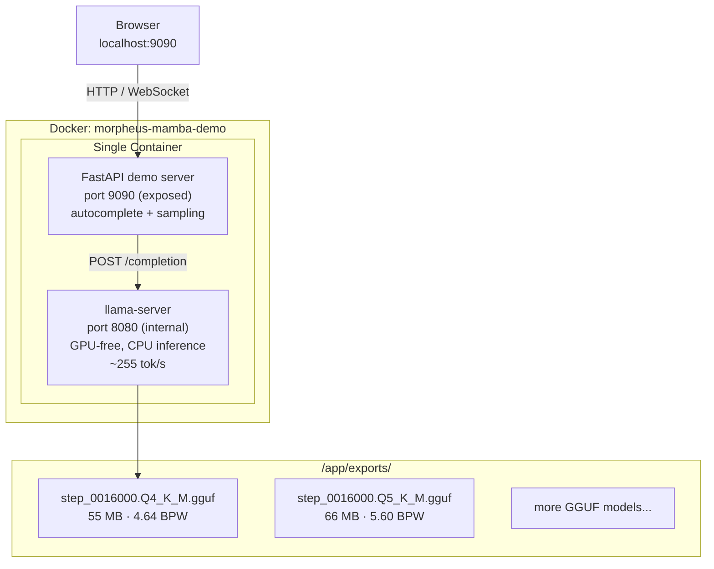

# Morpheus-Mamba Demo — Architecture & Features

> **Live demo**: `http://localhost:9090` (Docker)  
> **Model**: Morpheus v2 (91M) Mamba-2 — step 74K checkpoint (best), Q4_K_M quantized  
> **Training status**: Complete (76K steps, ~10B tokens, held-out PPL 7.13)

---

## Architecture



**Single container, two processes**: `llama-server` runs on port 8080 (internal only, not exposed to host) for raw inference. The FastAPI server on port 9090 adds the smart autocomplete layer: token alignment, ghost text computation, and output filtering. The container builds llama.cpp from source for latest Mamba-2 support — no dependency conflicts with host-installed llama-cpp-python.

---

## Endpoints

| Method | Path | Purpose |
|--------|------|---------|
| `GET` | `/` | Sampling mode UI (`index.html`) |
| `GET` | `/index-greedy.html` | Greedy / Smart Compose UI |
| `GET` | `/health` | Server status + current model name |
| `GET` | `/api/model` | Current model + list of available GGUF files |
| `POST` | `/api/model/reload?model=X` | Hot-swap model (kills & restarts llama-server) |
| `GET` | `/api/autocomplete/greedy` | Smart Compose autocomplete (temp=0, greedy) |
| `GET` | `/api/autocomplete` | Sampling autocomplete (configurable temperature) |
| `WS` | `/ws` | WebSocket streaming autocomplete (sampling) |
| `WS` | `/ws/greedy` | WebSocket streaming autocomplete (greedy) |

---

## Autocomplete Features (Smart Compose style)

The demo supports two autocomplete modes: **greedy** (deterministic, temp=0, Smart Compose-like) and **sampling** (temperature-controlled). Both share the same smart context + ghost suffix pipeline.

### Smart Context (`smart_context`)

The model operates on SentencePiece tokens. If the user types a partial subword fragment (like `"mod"` in `"zer mod"`), feeding the raw text would include a broken token. `smart_context` strips only trailing non-`▁` tokens (true subword continuations), keeping all `▁`-prefixed tokens intact.

```
User types:  "Gaur nire ama berandu irit"
Tokens:      [▁Gaur, ▁nire, ▁ama, ▁berandu, ▁iri, t]
                   ↑       ↑      ↑          ↑      ↑    ↑
                 all ▁-prefixed (kept)           non-▁ (stripped)

smart_ctx:   "Gaur nire ama berandu iri"
Model sees:  "Gaur nire ama berandu iri" → predicts "tsi da."
```

**Rules**:
- Text ending with space → keep all (user finished a word)
- Strip only trailing non-`▁` tokens (subword fragments like `t`, `z`, `d`)
- All `▁`-prefixed tokens stay — the model gets full context
- Single-word input like `"Kaixo"` stays as-is

### Ghost Suffix (`ghost_suffix`)

Smart Compose shows only the **novel** part of the prediction as ghost text. If the user already typed part of the predicted completion, the overlap is hidden.

```
User:  "Kaixo, zer mo"     smart_ctx: "Kaixo, zer m"
Model: " moduz?"            excluded: "mo"
                            overlap: "mod" (user typed) ≈ " mod" (predicted prefix)
                            → ghost:  "uz?"     (only the non-overlapping suffix)
```

**Punctuation boundary check**: If the user's text ends with punctuation (`.`, `?`, `!`) and the model starts with the same character, the leading punct is stripped from the ghost to avoid doubling (`"Kaixo?" + "? zer"` → ghost `" zer"` instead of `"? zer"`).

### Cursor-aware behavior

- Ghost text only appears when cursor is at the **end of the text** (line-end autocomplete)
- Moving cursor mid-text clears ghost and stops suggestions
- **Tab** key accepts the ghost text
- Any other keystroke replaces the ghost (browser selection behavior)
- Mouse clicks do not trigger autocomplete — user can select/copy/paste freely
- `_showingGhost` flag prevents `showGhost()` → `input` event → `onInput()` re-fetch loops

---

## Output Filtering (for undertrained models)

Our model is at step 30k of 152k (~20% complete). It produces noise: repeated punctuation, replacement characters (`\ufffd`), and unstable completions. These are model artifacts — the training data contains encoding errors and insufficient epochs — but we filter them at the demo layer so the UI remains usable for evaluation.

### `filter_suggestion`

Applied to both `suggestion` and `ghost_suffix` in all endpoints (HTTP + WebSocket). Enabled by default, toggleable via `filter_punctuation` query param.

| Rule | Example input | Example output |
|------|--------------|----------------|
| Strip `\ufffd` replacement chars | `"kaixo\ufffd!"` | `"kaixo!"` |
| Replace `▁` markers with spaces | `"▁▁hi"` | `" hi"` |
| Collapse runs of same/different punct → first char only | `"da??) eta"` | `"da? eta"` |
| Strip trailing space-punct junk | `"hello . ,"` | `"hello"` |
| Reject pure punct+whitespace (no words) | `" .,"`, `" . "` | `""` (empty) |
| Preserve bare single punct (legit sentence end) | `"."`, `"?"` | `"."`, `"?"` |
| Preserve leading space (word boundary signal) | `" bezala.."` | `" bezala."` |
| Reject pure punct suggestion when user already ends with punct | `"Kaixo, " + "."` | `""` (avoids `"Kaixo, ."`) |

### Why this matters

Without filtering, the greedy demo would show suggestions like:
- `"koskorra da??) eta zer da??"` → 12 tokens of repeated `??` spam
- `"Kaixo, ."` → comma then period (invalid in any language)
- `"z?,\ufffd"` → mixed punct + replacement char

With filtering, the same predictions become:
- `"koskorra da? eta zer da?"` — clean single punctuation
- `""` — rejected, no bogus ghost
- `"z?"` — single legit punct

These filters will become unnecessary as training converges (~step 120k+). Design is modular: disable via `filter_punctuation=false` to see raw model output.

---

## Sampling Mode (`/`)

The sampling UI lets you test the model as a general text generator, separate from the Smart Compose pipeline.

**Controls**:
- **Temperature** (0.0–2.0): higher = more creative/diverse
- **Max tokens** (1–24): how many tokens to generate
- **Min confidence**: threshold to show ghost text
- **Mode**: HTTP (debounced) or WebSocket (streaming, lower latency)
- **Token visualization**: shows how the text is split into SentencePiece tokens

**Behavior**:
- Shared `smart_context` and `filter_suggestion` pipeline
- Ghost suffix deduplication
- Tab to accept, cursor-end-only autocomplete
- No click-triggered suggestions

---

## Greedy Mode (`/index-greedy.html`)

Smart Compose-style autocomplete with greedy decoding.

**Controls**:
- **Tokens** (1–12): how many tokens to predict
- **Min confidence**: ghost threshold (default 10%)
- **Token viz**: show token boundaries
- **Filter punct**: enable/disable `filter_suggestion` (default on)

**Behavior**:
- `temperature=0.0`, `top_p=1.0`, `repeat_penalty=1.1`
- Same smart context + ghost + filter pipeline
- Cursor-end-only, tab to accept, no click triggers

---

## Model Hot-Reload (`POST /api/model/reload`)

Swap models without restarting the Docker container. The endpoint kills the current `llama-server` process and starts a new one with the requested GGUF file.

```
POST /api/model/reload?model=morpheus-v2-clean.Q5_K_M.gguf
→ {"status": "ok", "model": "morpheus-v2-clean.Q5_K_M.gguf"}
```

The model list at `GET /api/model` shows all GGUF files in the `exports/` directory with file sizes, useful for comparing checkpoints.

---

## Docker Setup

The GGUF model is **downloaded automatically from HuggingFace**
([itzune/morpheus-gguf](https://huggingface.co/itzune/morpheus-gguf)) on first
start and cached in a Docker volume. No local model files are needed.

All Docker files live under `demo/`. Run commands from the `demo/` directory.

### CPU mode (default)

```bash
cd demo

# Default model (step_0074000.Q4_K_M.gguf, CPU inference)
docker compose up -d

# Custom model
MORPHEUS_MODEL=step_0074000.Q5_K_M.gguf docker compose up -d

# Rebuild after code changes
docker compose up -d --build
```

### GPU mode (requires NVIDIA Container Toolkit)

GPU mode rebuilds llama.cpp with CUDA support and offloads all layers to the
GPU (`-ngl 99`), giving ~10x faster inference.

```bash
cd demo

# GPU mode
docker compose -f docker-compose.yml -f docker-compose.gpu.yml up -d

# Custom model in GPU mode
MORPHEUS_MODEL=step_0074000.Q5_K_M.gguf \
  docker compose -f docker-compose.yml -f docker-compose.gpu.yml up -d

# Rebuild GPU image after code changes
docker compose -f docker-compose.yml -f docker-compose.gpu.yml up -d --build
```

**Prerequisites for GPU mode:**
- NVIDIA GPU with CUDA support
- [NVIDIA Container Toolkit](https://docs.nvidia.com/datacenter/cloud-native/container-toolkit/install-guide.html) installed on host
- Verify with: `docker run --rm --gpus all nvidia/cuda:12.4.0-runtime-ubuntu22.04 nvidia-smi`

**How it works:** The GPU override (`docker-compose.gpu.yml`) rebuilds the
image with `GGML_CUDA=ON` using NVIDIA CUDA base images (devel for build,
runtime for execution) and reserves the GPU device for the container. The
`MORPHEUS_NGL` env var controls how many layers to offload (default `99` = all).

### Configuration reference

| Env var | Default | Description |
|---------|---------|-------------|
| `MORPHEUS_MODEL` | `step_0074000.Q4_K_M.gguf` | GGUF filename (downloaded from HF if not present) |
| `MORPHEUS_NGL` | `0` (CPU) / `99` (GPU) | GPU layers to offload (`0` = CPU only) |
| `HF_REPO` | `itzune/morpheus-gguf` | HuggingFace repo to download GGUF from |
| `HF_TOKEN` | _(empty)_ | Optional HF token for private repos |

The container builds llama.cpp from source (~2 min first run for CPU, ~5 min
for GPU with CUDA) for full Mamba-2 architecture support. The multi-stage
build keeps the runtime image small. The model is cached in the
`morpheus-models` Docker volume, so subsequent starts are instant — the model
is only downloaded once. To clear the cache and re-download, remove the volume:

```bash
docker compose down -v
```

> **⚠️ llama.cpp version requirement**: Builds must include commit `dc2187d48`
> ("ggml: fix SSM_SCAN for n_groups > 1", merged 2025-07-04). Earlier builds
> produce **silently incorrect** greedy outputs for Mamba-2 models — certain
> checkpoints appear to "forget" words they actually predict correctly.
> Concretely: step_0054000 showed `Kaixo` at 0% probability (broken) instead
> of 54.2% (correct) with the pre-fix build, while step_0032000 happened to
> work because its weights didn't trigger the bug. If you see a checkpoint
> that seems to have regressed, **rebuild the Docker image with `--no-cache`**
> before investigating the model:
> ```bash
> docker compose build --no-cache && docker compose up -d
> ```

---

## Testing

```bash
python3 demo/test_filters.py
```

Unit tests covering:
- `smart_context` — subword token stripping (8 cases)
- `ghost_suffix` — overlap dedup + punct boundary (9 cases)
- `filter_suggestion` — punct collapse, \ufffd, space preservation (22 cases)
- Pipeline integration — end-to-end smart_ctx → filter → ghost (4 cases)

---

## Known Limitations

| Issue | Cause | Mitigation |
|-------|-------|------------|
| Date/number prediction artifacts | Corpus dominated by encyclopedic/journalistic prose | Post-hoc filtering or domain reweighting (§6.12) |
| Repetition loops on some prompts | Greedy decoding artifact | Repeat penalty or nucleus sampling |
| Agglutinative morphology | Multiple valid continuations distribute probability | Documented in CSR paradox (§6.14) |
| CSR doesn't track model quality | Exact-match metric limitations | PPL used as primary metric (§6.15) |

---

## Next Steps

1. ~~Continue training to convergence~~ — Complete (76K steps)
2. Scale CSR evaluation to 1000+ sentences for tighter confidence intervals
3. Investigate the CSR inversion (§6.15) with a larger, more diverse evaluation set
4. Collect completion logs from real usage and replay across checkpoints
5. Consider domain-specific fine-tuning for specialized use cases
