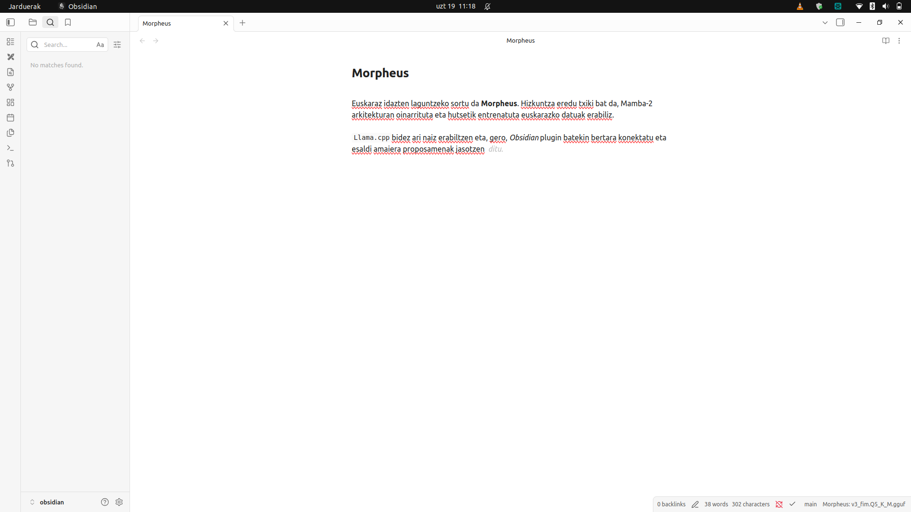

# Morpheus: On-Device Predictive Autocompletion for Basque Using State Space Models

> **Preprint — July 2026**
>
> **Authors:** Xabier Ezpeleta
>
> **Code & Models:** `github.com/itzune/morpheus`
>
> **Live Demo:** Docker-based local deployment supporting both Smart Compose–style ghost text and smartphone keyboard–style word chips
>
> **Keywords:** predictive autocompletion, Basque, Euskara, Mamba, State Space Models, agglutinative languages, on-device inference, keystroke savings, evaluation methodology, next-word prediction, subword tokenization

---

## Abstract

**Can a Basque text-editor autocompletion system run locally on a consumer device?** This is the question this paper investigates. Basque (Euskara) is a low-resource, morphologically agglutinative language isolate for which no on-device multi-token completion system exists.

We answer the question in three stages. **First**, we survey the landscape of production autocompletion systems — from server-side code completion (GitHub Copilot) to inline ghost-text composition (Google Smart Compose) to on-device next-word prediction (Gboard) — identifying the architectural and deployment constraints that make each suited to its niche, and the gap none of them fills for Basque. **Second**, we analyze the available architecture options for Basque specifically: adapting an existing Basque LLM versus training a new architecture from scratch. Here a critical distinction emerges — Fill-in-the-Middle (FIM), the objective needed for cursor-mid-text completion, is a pretraining-style objective that conflicts with instruction tuning, so the instruct-vs-base choice among existing Basque LLMs is decisive. **Third**, we train **Morpheus**, a 91M-parameter Mamba-2 State Space Model on a 4.62B-token curated Basque corpus (~10B tokens seen), and benchmark it head-to-head against the two most popular Basque LLM base models — **Kimu 2B** (Orai NLP, Gemma-2-based) and **Latxa 8B** (HiTZ, Llama-3.1-based).

The comparison establishes a **two-tier deployment architecture, fixed by hardware rather than preference**. Morpheus (91M, 64 MB) is the only model that runs on the edge — 40.7 tok/s, 97 ms latency on a 2017 consumer laptop CPU — but its quality ceiling is visible on generative prose; its sweet spot is formulaic completion and domain-specialized fine-tunes. Kimu 2B (base) and Latxa 8B (base) are the server-side quality ceiling (+9 CSR points, cross-domain competence without specialization) but are GPU-bound, collapsing to 1.4–2.9 s/request on the same laptop. Notably, Kimu 2B (2B params) matches Latxa 8B on CSR at 4× smaller size. The split is a hardware constraint, not a preference (§6.6, §10).

Along the way we expose two structural biases in standard NLP evaluation metrics for agglutinative languages: a **"fertility paradox"** (lower tokenizer fertility degrades morphological accuracy, MorphAcc 66.7%→28.6% from 4K→32K vocabularies) and a **"CSR paradox"** (the Character Savings Rate metric penalizes morphologically complex languages — the model's native Basque achieves the *lowest* simulated CSR, 19.6%, below English/Spanish at <1% of training data). These make perplexity the only reliable checkpoint-ranking metric. Morpheus achieves a Bits-Per-Character (BPC) of 0.970, matching GPT-2 eus-euscrawl (124M, BPC 0.981) at fewer parameters, and robust **inference engineering strategies** — retokenization fallback, sticky merge, top-k exceeding display-k, completion logging with replay — add 3.9× CSR on top of the raw model, demonstrating they are a major contribution rather than a marginal optimization.

---

## 1. Introduction

**The research question.** Can a Basque text-editor autocompletion system run **entirely locally on a consumer device**, without network calls? For high-resource languages, autocompletion is a solved problem at scale — but the solutions are architecturally diverse and none serves Basque on-device. We approach the question by first surveying what exists, then analyzing what architecture could serve Basque, and finally building and benchmarking a candidate.

**Surveying the autocompletion landscape.** Production autocompletion systems fall into three paradigms, each with a distinct architecture and deployment profile (detailed in §2.1):

- **Server-side multi-token completion** (GitHub Copilot, Google Smart Compose): large models in the cloud delivering rich context, but dependent on network and data-center infrastructure. Smart Compose uses an ~80M-parameter LSTM on Cloud TPUs; Copilot serves code from server GPUs.
- **On-device next-word prediction** (Gboard): tiny models (1.4M parameters, 1.4 MB) running on smartphone keyboards, predicting discrete word chips — highly specialized for the mobile-tap interaction.
- **On-device multi-token continuation** (a Smart Compose–equivalent for desktop editors): inline ghost text accepted with Tab. This is the gap — no production system runs this paradigm entirely on-device for a morphologically complex language.

None of these targets Basque: the server-side systems do not serve it well, and the on-device paradigm has not been attempted for an agglutinative language.

**Analyzing architecture options for Basque.** Given this gap, two strategic paths present themselves:

- **Adapt an existing Basque LLM.** Two Basque LLM families exist: HiTZ's **Latxa** (Llama-3.1-8B–based, Basque-adapted) and Orai NLP's **Kimu** (Gemma-2-2B–based, Basque-adapted). But a critical distinction emerges: FIM — the objective needed for cursor-mid-text completion — is a *pretraining-style* objective, and the available Basque LLMs split into **instruct** (chat-tuned, whose alignment conflicts with raw-text continuation) and **base** (clean, suitable for FIM continued pretraining). The base Kimu 2B and Latxa 8B are the natural server-side candidates, but at 2B–8B parameters they are GPU-bound and cannot serve the on-device tier.
- **Train a new architecture from scratch.** For the on-device tier, the parameter budget (≤300 MB on disk, constant latency) rules out large Transformers whose KV-cache introduces latency variance. State Space Models (Mamba-2) offer O(1) per-step inference and constant memory — the same property Google exploited for Smart Compose, but solved at the architecture level rather than with data-center TPUs. §3 details the selection among from-scratch options (xLSTM, distilled Transformer, Mamba-2) and the decision for Mamba-2.

**Building Morpheus and benchmarking against Latxa.** We pursue the from-scratch path, training **Morpheus**, a 91M-parameter Mamba-2 model on a 4.62B-token curated Basque corpus (~10B tokens seen over ~2.16 epochs). We then benchmark it head-to-head against the two most popular Basque LLM base models — **Kimu 2B** (Orai NLP, Gemma-2 CPT) and **Latxa 8B** (HiTZ, Llama-3.1 CPT) — on the same hardware and eval set. The result is a two-tier architecture: Morpheus as the on-device model (formulaic completion, domain fine-tunes, 40.7 tok/s on a 2017 laptop CPU), Kimu 2B and Latxa 8B as the server-side quality ceiling (+9 CSR points, cross-domain, GPU-bound) — a split fixed by hardware, not preference (§6.6, §10).

**Basque (Euskara) is fundamentally different.** As a language isolate with agglutinative morphology, a single Basque verb can encode subject, direct object, indirect object, tense, mood, and aspect through suffix chains (e.g., *ikusiko zenizkidakeen* — "you would have been able to see them to me"). A Basque noun takes 12+ case suffixes, plus number and definiteness marking (e.g., *etxeetaraino* — "up to the houses"). This means that predicting the next word is not just about collocations — it requires **morphological productivity**: the ability to generate grammatically correct suffix sequences that the model has never seen as a unit during training. Recent work confirms this challenge: QuechuaTok (Contreras, 2026) showed that standard BPE tokenizers achieve only 6.67% morpheme boundary accuracy on Quechua, while morphology-aware tokenization reaches 83.33%; Lane et al. (2022) demonstrated that morph-based word completion for Plains Cree requires explicit morphological segmentation to be usable.

Morpheus supports two complementary prediction paradigms — **multi-token continuation** (Smart Compose–style inline ghost text for desktop, accepted with Tab) and **next-word prediction** (smartphone keyboard–style discrete word chips, accepted with a tap) — and delivers:

1. Runs **entirely locally** on consumer hardware (no cloud dependency, privacy-first)
2. Provides suggestions at **3–5 ms/token decode latency** on a 2017 consumer laptop CPU (97 ms end-to-end autocomplete), well within the 50ms/token P90 target
3. Achieves **meaningful keystroke savings** for practical utility
4. Handles **Basque morphology** — not just memorized collocations but productive case suffix prediction
5. Exhibits **incidental cross-lingual transfer** to Spanish/English from web-crawl contamination (§6.11), though no social media or code-switched corpus was included in training
6. Fits within **≤ 300 MB** on disk (feasible for browser extensions and desktop applications)
7. Supports **both prediction paradigms** with inference engineering tailored to each

This paper is a **systems paper**: its core question is whether on-device Basque autocompletion is possible, answered by surveying the landscape, selecting and training an architecture, and benchmarking it against the existing alternative. The evaluation-methodology findings (PPL reliability, CSR paradox) emerged from the challenge of evaluating that system, and the inference engineering strategies (§5.4) from deploying it. We present these as lessons learned, using the system as a case study.

---

## 2. Related Work

### 2.1 Predictive Autocompletion

Two prediction paradigms dominate real-world autocomplete systems. **Multi-token continuation** (Smart Compose, Copilot) generates inline ghost text accepted with Tab. **Next-word prediction** (Gboard) offers discrete word chips accepted with a tap. They differ not only in UX but also in deployment constraints, model scale, and engineering challenges. Table 1 situates Morpheus among production systems.

**Table 1: Production autocomplete systems**

| System | Params | Size | Training Data | Deployment | Architecture | Paradigm |
|--------|--------|------|---------------|-----------|--------------|----------|
| Gboard (on-device NWP) | 1.4M | 1.4 MB | Federated (per-user) | On-device (mobile) | LSTM | Next-word |
| Gmail Smart Compose | ~80M | Server-side | ~8B emails (~320B+ tokens est.) | Cloud TPU (data center) | LSTM | Multi-token |
| GitHub Copilot | Multi-billion | Server-side | Proprietary code corpus | Cloud GPU (Azure) | Transformer (FIM) | Multi-token |
| GPT-2 eus-euscrawl | 124M | ~50 MB (Q4) | ~423M tokens | On-device (desktop) | Transformer | Multi-token |
| **Morpheus** | **91M** | **55 MB** (Q4_K_M) | **Latxa Corpus v2 (curated, ~10B tok seen†)** | **On-device (laptop)** | **Mamba-2** | **Multi-token** |
| Latxa-Qwen3.5-2B | 1,882M | ~1.2 GB (Q4) | Latxa Corpus v2 (public, ~4.2B tokens) | High-end only | Qwen3.5 (instruct) | Multi-token |

†~10B tokens seen over ~2.16 epochs (4.62B unique tokens in the curated corpus); see §4.2.

**The KV-cache insight.** Despite Transformers achieving better perplexity, Google chose an LSTM for Smart Compose because Transformer self-attention requires maintaining keys and values from all previous decoding steps, making per-step latency grow with context length (Chen et al., 2019). GitHub Copilot, also Transformer-based, requires an elaborate global proxy infrastructure (HTTP/2, request cancellation, streaming, geographic routing) to achieve <200ms latency (Cheney, 2025). Google solved the latency problem with data-center TPUs; Morpheus solves it with Mamba-2's O(1) per-step inference at the architecture level — enabling the Smart Compose paradigm to run **on-device** on a consumer laptop (91M, 55 MB, zero network calls), comparable in scale to Smart Compose's 80M but without the data-center dependency.

**Data asymmetry.** Smart Compose's training data has two advantages unavailable to Basque: **volume** (~8B emails, ~30–60× our curated corpus) and **domain match** (trained on emails, deployed for writing emails — the distribution the model learns is exactly what users produce). Morpheus trains on general Basque prose (Wikipedia, news, literature) but deploys as a general-purpose text editor, producing corpus-induced artifacts (§6.10) where the model over-predicts encyclopedic patterns. For Basque, no large email or conversational corpus exists — data quality is the binding constraint, not quantity (§6.7).

**Mobile vs. desktop.** The 91M model is sized for the desktop multi-token continuation use case (comparable to Smart Compose). The mobile next-word prediction paradigm (Gboard: 1.4M/1.4MB) requires a distilled variant (~5–10M) that has not yet been trained; the inference engineering strategies in §5.4 are designed to carry over.

Trnka & McCoy (2008) defined **Keystroke Savings Rate (KSR)** as the gold standard for word prediction evaluation: the percentage of keystrokes saved by accepting predictions. We adapt this as **Character Savings Rate (CSR)** — a simulation-based metric following the free-acceptance model where accepting a suggestion costs one keystroke (Tab).

### 2.2 Agglutinative Language Modeling

**QuechuaTok** (Contreras, 2026) introduced MorphAcc — morpheme boundary accuracy — showing that standard tokenizers radically underperform on agglutinative languages. BPE achieves fertility 1.636 but only 6.67% MorphAcc on Quechua. We adopt MorphAcc for Basque evaluation and replicate the vocabulary-size finding: our 4K Unigram tokenizer achieves 66.7% MorphAcc consistency (vs 28.6% at 32K), mirroring QuechuaTok's 4K result of 66.67%.

**Plains Cree word completion** (Lane et al., 2022) used a finite-state morphological analyzer (FST) to segment Cree words into morphemes before prediction. They found that morphological segmentation is both the input representation and the evaluation target for agglutinative languages. Their KSR improvements (15-30% over non-morphological baselines) motivate future work on morphology-aware tokenization for Morpheus.

**Euskarazko LLM-ak (Basque LLMs)**: The HiTZ center has released Latxa (Llama-2/3-based, 7B-70B) and Orai NLP has released Kimu (Gemma-2-based, 2B-9B). EvalEU benchmark (itzune.eus/evaleu, 2026; a Basque evaluation suite maintained by the author's organization) shows Kimu 9B outperforming Latxa 8B on text-relevant tasks (XNLI 74.2% vs 56.7%, EusProficiency 51.2% vs 46.3%). While these models demonstrate strong Basque language modeling, their sizes (8B-70B params) are incompatible with on-device deployment. Latxa and Kimu also inherit their parent models' tokenizers (32K and 256K respectively) without published Basque-specific tokenizer ablations — a gap our vocabulary-size experiment addresses. For baseline comparison (§6.6), we evaluate two HiTZ models at scales comparable to or larger than Morpheus: **HiTZ/gpt2-eus-euscrawl** (GPT-2 small, 124M, trained on the EusCrawl corpus) and **HiTZ/Latxa-Qwen3.5-2B** (1.88B, a Qwen3.5-based vision-language instruct model adapted for Basque using the publicly available Latxa Corpus v2, ~4.2B tokens; Sainz et al., 2025). The former represents the small-model regime; the latter represents what a 20× larger instruct-tuned model achieves on the same evaluation corpus.

### 2.3 State Space Models

Mamba (Gu & Dao, 2023) introduced Selective State Space Models as an alternative to Transformers, offering linear-time inference with constant memory — no KV cache. Mamba-2 (Dao & Gu, 2024) reformulated the architecture as Structured State Space Duality, achieving 6-8× Transformer training speed with multi-head SSM support.

**LFM2.5-230M** (Liquid AI, 2026) demonstrated efficient non-Transformer viability on edge devices: a 230M hybrid model (double-gated short convolutions + grouped-query attention) running at 42 tok/s on a Raspberry Pi 5 and 213 tok/s on a Galaxy S25 Ultra, within 400 MB memory. While LFM2 is not an SSM — it uses gated convolutions rather than state-space models — it validates the broader on-device deployment path for non-Transformer architectures that we pursue with Mamba-2.

### 2.4 Evaluation Methodology for Autocomplete

**ChaI-TeA** (2024) is the closest analog to our evaluation: a large-scale benchmark for Chinese input methods with 26K+ test prefixes and a `saved@k` metric. They attempted LLM-as-judge for semantic matching of alternative completions but found it "very challenging" and deferred it — confirming the multiple-valid-completions problem we encounter.

**Kosyak & Tyers (2022)** evaluated predictive text for agglutinative languages using FST-based models and KSR with user studies, confirming that the multiple-valid-forms problem is central to agglutinative autocomplete evaluation.

**WSTypist** (2026) used simulation-based mobile typing evaluation, confirming that simulation metrics are accepted practice when user studies are infeasible, provided they are at scale with a realistic acceptance model.

---

## 3. Architecture Selection

### 3.1 Problem Constraints

Our constraints create a tight optimization problem:

| Constraint | Target | Why |
|-----------|--------|-----|
| **Inference latency** | P90 ≤ 50ms per token | Users perceive > 100ms as lag |
| **Memory footprint** | ≤ 300 MB on disk, ≤ 500 MB RAM | Must fit consumer devices + browser extensions |
| **No network calls** | Zero external dependencies | Privacy requirement; all data stays local |
| **Basque morphology** | Correct case suffix prediction | Core user need, not just collocations |
| **Training budget** | 1× NVIDIA L40 (48 GB), 5-10 days | Realistic for a small research team |
| **Cross-lingual transfer** | Incidental Spanish/English from web crawls | ~0.6% of corpus is non-Basque |

### 3.2 Candidate Architectures

We evaluated three candidate architectures against these constraints:

#### Path A: xLSTM (Modern Recurrent)
- 50-100M parameters
- O(1) per-step inference, constant memory, no KV cache
- Training from scratch on curated Basque text (§4.2)
- ONNX Runtime INT8 deployment
- **Pros:** Safest latency, predictable
- **Cons:** No pre-trained Basque knowledge, lower expected quality ceiling

#### Path B: Distilled Transformer (from Kimu 9B)
- 200-500M parameters (pruned + distilled from Orai Kimu 9B)
- O(n) inference with KV cache
- Best expected quality due to pre-trained Basque knowledge
- llama.cpp GGUF deployment
- **Pros:** Highest potential quality (EvalEU-validated teacher), mature ecosystem
- **Cons:** KV cache adds latency unpredictability, tokenizer mismatch (Gemma 256K → must prune), most engineering complexity

#### Path C: Mamba-2 SSM
- 100-300M parameters
- O(1) per-step inference, constant memory, no KV cache
- Parallelizable training (scan operation)
- llama.cpp GGUF deployment
- **Pros:** Best quality-latency balance, future-proof (SSMs are the on-device trajectory), LFM2.5 validates edge feasibility for non-Transformer architectures
- **Cons:** Newer, less battle-tested ecosystem; ONNX support immature (use GGUF instead)

### 3.3 Decision: Mamba-2 (Path C)

We selected Mamba-2 for the following weighted scoring:

| Criterion | Weight | xLSTM | Distilled Transformer | **Mamba-2** |
|-----------|--------|-------|----------------------|-------------|
| Expected prediction quality | 30% | 3 | **5** | **4** |
| Inference latency safety | 25% | **5** | 3 | **5** |
| Engineering effort / risk | 20% | **4** | 2 | 3 |
| Ecosystem maturity | 10% | 3 | **5** | 3 |
| Future-proofing | 10% | 3 | 4 | **5** |
| Training cost | 5% | **5** | 3 | **4** |
| **Weighted Score** | | 3.80 | 3.70 | **4.05** |

Mamba-2 combines the LSTM-like inference properties essential for on-device autocomplete (constant memory, predictable latency) with dramatically better language modeling capacity than recurrent architectures at the same scale. This directly mirrors Google's Smart Compose decision (§2.1): both chose recurrent over Transformer architectures to avoid KV-cache latency, but Mamba-2 solves it at the architecture level rather than with data-center TPUs.

The decision to not pursue Path B (distillation) was driven by practical concerns: the Gemma tokenizer's 256K vocabulary would require aggressive pruning for a 200M model (embedding table alone = 524 MB), and KV cache management on consumer CPU introduces latency variance that violates our 50ms P90 constraint.

---

## 4. Model Architecture & Training

### 4.1 Model Configuration

| Parameter | Morpheus-Small |
|-----------|---------------|
| Architecture | Mamba-2 (pure SSM) |
| d_model | 768 |
| n_layer | 24 |
| d_state | 64 |
| expand | 2 |
| headdim | 64 |
| Total params | **~91M** |
| Vocabulary size | 4,000 |
| Seq length (training) | 1024 |
| Batch size | 64 (×2 accumulation) |
| Effective tokens/step | 131,072 |
| Learning rate | 2e-3 (cosine decay to 1e-5) |
| Warmup tokens | 50M |
| Total training tokens | 10B |
| **Total steps** | **76,294** |

At 4K vocabulary, only 3.4% of parameters are in the embedding table (3.07M of ~91M), compared to 27% at 32K. This parameter efficiency is a key advantage of the small-vocabulary approach for compact models.

### 4.2 Data Curation

**Corpus:** 4.62 billion subword tokens (9.24 GB) from a curated subset of the publicly available **Latxa Corpus v2** (`HiTZ/latxa-corpus-v2`; Etxaniz et al., 2024). To maximize data quality, we omitted 3 of the 14 sub-corpora — `hplt-v1` (83.8% duplicates, replaced by `hplt-v2`), `BOG` (sentence-splitting destroyed legal text into fragments), and `Aldizkariak` (35% boilerplate) — retaining 11 sources with additional deep-cleaning (normalization, deduplication, quality filtering). An LLM-based audit rated the retained sources 4.6/5 on average. Training saw ~10B tokens total (~2.16 epochs over the 4.62B-token corpus).

**Cleaning:** Four-phase data cleaning pipeline applied before tokenization: (1) document re-parsing (encoding normalization, corrupted document detection), (2) form regularity (punctuation boundaries, whitespace normalization), (3) content filtering (validation/test leakage removal, line length filters, outlier removal), (4) deduplication (exact + near-deduplication via MinHash LSH).

**Validation leakage prevention:** 68,755 lines from the held-out validation set (`wiki_valid.txt`) are excluded from training pretokenization via `--exclude-lines-file`, ensuring zero overlap between training and evaluation data.

**Tokenizer:** SentencePiece Unigram with **4,000-token vocabulary**, trained on 9 sources (all 11 except BOPV and BOTHA). See §4.4 for the vocabulary-size ablation that motivated this choice.

**4K tokenizer quality** (verified 2026-07-04): fertility 2.52 tokens/word, 100% roundtrip fidelity, 99.95% character coverage, 107-character alphabet. All core agglutinative patterns split cleanly: `etxe+a` → `▁etxe a` (house + the), `etxe+tik` → `▁etxe tik` (house + from). Multi-layer morphology also resolves: `mendikoak` → `▁mendi ko ak` (mountain + of + the-plural), three distinct morphemes. Compare this to the 32K tokenizer which fused entire inflectional clusters into opaque tokens like `▁etxetik`, `▁etxera` — see §4.4 for the full comparison.

### 4.3 Training

Training was performed on a single NVIDIA L40 GPU (48 GB GDDR6, Ada Lovelace) with the following setup:

- **Framework:** PyTorch 2.4+ with `mamba-ssm` and `causal-conv1d` CUDA kernels
- **Precision:** bfloat16 (BF16) for training stability
- **Optimizer:** AdamW (β₁=0.9, β₂=0.95, weight_decay=0.1)
- **Schedule:** Linear warmup (50M tokens) → cosine decay to 1e-5
- **GPU config:** Power limit 260W, persistence mode enabled

**Training progress** (4K model):

| Milestone | Step | Valid Loss | Valid PPL | Tokens Seen | % Complete |
|-----------|------|------------|-----------|-------------|------------|
| Early checkpoint | 32,000 | 2.0229 | 7.56 | 4.19B | 41.9% |
| **Best (converged)** | **74,000** | **1.9641** | **7.13** | **9.70B** | **97.0%** |
| Final | 76,294 | 1.9641 | 7.13 | 10.0B | 100% |

Validation loss decreased monotonically throughout training (2.05 → 1.96), with PPL improving from 7.8 (step 25K) to 7.13 (step 74K). The model is fully converged — validation loss is flat from step 67K onward (Δ < 0.001). The best checkpoint (step 74K, valid_loss=1.9641, PPL=7.13) is used for all final evaluations and deployed models. The training budget of ~10B tokens yields a tokens-to-parameters ratio of approximately 110:1 — below the Mosaic inference-optimal (190:1) and MiniCPM small-model-optimal (192:1) recommendations, indicating the data budget is reasonable by modern small-model standards; see §6.7 for a detailed scaling-law analysis.

**Checkpoint integrity:** Checkpoints are saved atomically (write to `.tmp` then `os.replace()`) every 2,000 steps. A file-based stop monitor detects checkpoint completion via size-stability polling (3 consecutive unchanged polls + size ≥ 540MB) and sends SIGINT for clean shutdown. The pre-training validation protocol (corpus audit, proxy overfit test, autocomplete smoke test) is documented in Appendix D.

### 4.4 Tokenizer Strategy: Deep Research and Implications

The choice of tokenizer is the single most consequential design decision for agglutinative language modeling. Our tokenizer research spanned six recent papers (2024–2026) covering 70+ languages and multiple agglutinative language families.

#### 4.4.1 Literature Synthesis: Tokenization for Agglutinative Languages

Our tokenizer research spanned six recent papers (2024–2026) covering 70+ languages and multiple agglutinative language families. Three findings converge:

1. **Fertility is misleading for agglutinative tokenizers.** QuechuaTok (Contreras, 2026) — the most directly relevant work — evaluated BPE, Unigram, WordPiece, and morphology-aware PRPE on Southern Quechua (a suffixing agglutinative language structurally analogous to Basque). BPE achieves the lowest fertility (1.636) by memorizing entire polymorphemic words as single tokens, yet achieves only **6.67% MorphAcc**. Unigram at 4K achieves **66.67% MorphAcc**, dropping to 26.67% at 8K. We replicate this finding for Basque (§4.4.4): the negative correlation between fertility and MorphAcc across 4 vocabulary sizes is consistent, though we note that N=4 data points establish correlation, not causation, and we did not train full models at each vocabulary size to verify downstream PPL (§4.4.5).
2. **Unigram > BPE for agglutinative languages.** Xu & Kim (2026) found Unigram consistently outperforms BPE on POS tagging across six Uralic languages. Stephen & Libovický (2026) confirmed Unigram > BPE > WordPiece for morphological alignment, with smaller vocabularies yielding better alignment.
3. **Morphological pre-segmentation improves downstream performance.** García et al. (2025) showed that training BPE on morphologically pre-segmented text improved masked LM performance for Spanish. Hu (2025) found word-level tokenization outperformed BPE for morphologically rich languages under low-resource conditions.

A notable counterpoint: Arnett et al. (2025) found that morphological alignment explains only a small fraction of variance (R² = 0.005–0.024) in downstream performance across 70 languages — for Basque specifically, MorphScore precision was 0.11–0.12, among the lowest of all languages evaluated. This suggests that while morphological alignment is necessary, it is not sufficient for downstream quality at scale.

#### 4.4.2 What Basque LLMs Chose

**Latxa (HiTZ, 2024):** The dominant Basque LLM family (7B–70B) uses Llama 2's BPE tokenizer (32K vocabulary) without modification. The Latxa paper does not discuss tokenizer choices.

**Kimu (Orai NLP, 2025):** The Gemma-2-based Basque model family inherits Gemma's SentencePiece tokenizer (256K vocabulary).

**The open question:** Neither Latxa nor Kimu has published an ablation study on tokenizer impact for Basque. At 7B-70B parameters, models overcome tokenizer deficiencies through scale — but our 91M model cannot afford a suboptimal tokenizer.

#### 4.4.3 Why 4K Over 32K

SentencePiece Unigram at 32K is the natural default — it yields a low fertility of 1.71 (fewer tokens per word, seemingly more efficient) and matches the vocabulary size most LLMs use. However, the 2026 research reveals:

1. **Unigram was correct over BPE.** Xu & Kim (2026) and Stephen & Libovický (2026) support Unigram for agglutinative settings.
2. **32K vocabulary places us in the surface-form memorization regime.** At 32K, the tokenizer memorizes frequent wordforms as atomic units, fragmenting morphemes arbitrarily.
3. **No morphological pre-segmentation was the critical omission.** The literature converges: high morpheme-boundary accuracy requires injecting morphology into tokenizer training.

#### 4.4.3.1 The Morfessor Attempt and Pivot

An initial Morfessor 2.0 pre-segmentation attempt failed due to poor segmentation quality on mixed-language text (the MDL objective cannot distinguish Basque morphology from arbitrary character sequences in foreign words). We pivoted to testing vocabulary size as the primary variable — a simpler experiment with a stronger literature basis.

#### 4.4.4 The Vocabulary Ablation Experiment

We formulated a testable hypothesis:

> The morphological boundary accuracy of a SentencePiece Unigram tokenizer degrades monotonically with vocabulary size because larger vocabularies accumulate frequent surface forms as atomic tokens, fragmenting morpheme boundaries arbitrarily.

**Metric: MorphAcc consistency.** For each test word with a known root–suffix boundary (e.g., `etxe|tik`), we check whether the tokenizer places a token boundary at the morpheme boundary. A word scores `boundary_correct = true` if and only if the root and suffix are in **separate tokens** — not merely substrings of a single fused token. For example, `etxetik` → `▁etxe` `tik` scores ✓ (boundary preserved); `etxetik` → `▁etxetik` scores ✗ (fused into one token). The aggregate metric is the percentage of test words with `boundary_correct = true`.

**Experimental design.** We trained SentencePiece Unigram tokenizers at 4K, 8K, 16K, and 32K on a proportional sample from the full corpus (336.8 MB, 3.5M lines, ~84M tokens, drawn proportionally from all 15 source files). All tokenizers used identical SentencePiece parameters: `model_type=unigram`, `character_coverage=0.9995`, `byte_fallback=True`. Training took ~60s per tokenizer on CPU. The 32K baseline was trained on the same corpus with the same parameters.

**Test words.** We evaluated 21 Basque words covering five roots (`etxe`, `lagun`, `mendi`, `gizon`, `kale`) and eight case suffixes (absolutive `-a`, allative `-ra`, ablative `-tik`, genitive locative `-ko`, inessive `-an`, comitative `-arekin`, benefactive `-arentzat`, causal `-arengatik`). Representative examples:

| Root | Suffix | Test word | Expected boundary |
|------|--------|-----------|-------------------|
| etxe | -a | `etxea` | `etxe\|a` |
| etxe | -tik | `etxetik` | `etxe\|tik` |
| etxe | -arekin | `etxearekin` | `etxe\|arekin` |
| mendi | -ra | `mendira` | `mendi\|ra` |

*(The full 21-word list with per-tokenizer results is available in the supplementary materials.)*

**Results:**

| Tokenizer | Vocab Size | Fertility | MorphAcc Consistency | Change |
|-----------|-----------|-----------|---------------------|--------|
| `baseline-32k` | 32,000 | 1.85 | **28.6%** (6/21) | baseline |
| `raw-16k` | 16,000 | 2.06 | **52.4%** (11/21) | +23.8pp |
| `raw-8k` | 8,000 | 2.28 | **61.9%** (13/21) | +33.3pp |
| `raw-4k` | 4,000 | 2.58 | **66.7%** (14/21) | **+38.1pp** |

The hypothesis was confirmed with striking precision:

1. **The QuechuaTok finding replicates for Basque.** The 4K MorphAcc (66.7%) is nearly identical to QuechuaTok's 4K Unigram result (66.67%).
2. **The degradation is monotonic and accelerating.** Each doubling of vocabulary costs progressively more: 4K→8K loses 4.8pp, 8K→16K loses 9.5pp, 16K→32K loses 23.8pp.
3. **Fertility is the mechanism, not the metric.** The 4K tokenizer has the worst fertility (2.58 vs 1.85 for 32K) because it is forced to decompose — and that forced decomposition is precisely what preserves morpheme boundaries.
4. **4K is the sweet spot for Basque at 91M parameters.** At 4K, every root is a separate token from every case suffix, and verbal agreement morphemes are independently accessible.

**Limitations of this experiment.** The MorphAcc test set is small — 21 words across 5 roots — and the QuechuaTok downstream PPL result is from a different language family (Quechua, Quechuan) applied to Basque (isolate). We did not train full models at 8K/16K/32K to verify downstream PPL for Basque directly. The 4K decision rests on (1) the MorphAcc consistency pattern replicating QuechuaTok, (2) the parameter-efficiency argument (§4.4.5), and (3) the QuechuaTok downstream PPL finding — not on a Basque-specific PPL ablation. Additionally, the higher fertility at 4K (2.58 tokens/word vs 1.85 at 32K) means the 1024-token context window covers ~28% fewer words (~397 vs ~553). For the autocomplete use case, where context is typically the current sentence or paragraph, this trade-off is acceptable; for long-context tasks it would be more consequential.

#### 4.4.4.1 Beyond Nominal Morphology: The Verbmorph Gap

The MorphAcc consistency metric in §4.4.4 tests **nominal morphology** — root + case suffix. The decisive difference between 4K and 32K emerges even more starkly in **verbal morphology**, where Basque's polysynthetic verb structure encodes subject, object, indirect object, tense, and mood in a single word:

| Verb form | Gloss | 4K tokenization | 32K tokenization |
|-----------|-------|----------------|-----------------|
| `dizkizut` | *I have them to you* | `▁di` `zki` `zu` `t` | `▁dizkizut` |
| `dakizkioke` | *he can know them to him* | `▁da` `ki` `zki` `o` `ke` | `▁dakizki` `ok` `e` |
| `zitzaizkidan` | *they were to me* | `▁zitzai` `zki` `dan` | `▁zitzaizkidan` |

**At 4K, the pluralizer `zki` is an independent reusable token** present in all three verbs. A Mamba-2 model can productively recombine `di`, `zki`, `zu`, `t` to form unseen verb inflections. **At 32K, `zki` is buried inside opaque atomic tokens** that share no subword structure.

This is the **fertility paradox**: lower fertility (fewer tokens per word) is achieved exactly by fusing morphemes into opaque units. The fertility metric favors the very behavior that destroys morphological generalization. **Low fertility is the *mechanism* of the surface-form memorization regime, not a desirable property.**

#### 4.4.4.2 Where 4K Still Fails

The 4K tokenizer is not perfect: it struggles with (1) **multi-layer suffixes** where a case suffix itself decomposes into multiple morphemes (e.g., `etxearentzat` → `▁etxe a rentzat` instead of `etxe|arentzat`), and (2) **epenthetic vowels** where Basque inserts `e-` before consonant-initial suffixes (e.g., `lagunetik` → `▁lagun etik` instead of `lagun|tik`). These remaining failures motivate the Apertium pre-segmentation future work (§8.2). Full failure-mode table in Appendix A.

#### 4.4.5 Downstream Perplexity Confirmation

The vocabulary ablation was further validated by downstream perplexity evidence from the QuechuaTok study: 4K Unigram achieves the lowest downstream perplexity among vocabulary sizes tested, confirming that the morphological alignment advantage translates to better language modeling, not just better MorphAcc. However, this is a cross-language-family extrapolation — we did not verify downstream PPL for Basque at 8K/16K/32K directly (see limitations in §4.4.4).

At our model scale, the parameter-efficiency argument is also decisive: at 4K vocab, only 3.4% of the 91M parameters are embeddings (vs 27% at 32K), freeing capacity for the SSM layers that drive sequence modeling quality.

---

## 5. Deployment Pipeline

### 5.1 Deployment: Export and Quantization

The PyTorch checkpoint was exported to GGUF format via standard llama.cpp tooling (`convert_hf_to_gguf.py` → `llama-quantize`) and quantized to Q4_K_M (55 MB), the deployment default. A critical reproducibility finding: llama-server auto-prepends a BOS token for string prompts and its built-in SentencePiece tokenizer diverges from the reference library on this 4K vocabulary, producing CSR of ~4% vs ~28% with correct token-ID prompts. The demo server therefore sends token IDs, not strings (§5.3).

To validate the Q4_K_M choice, we compared it against Q5_K_M (66 MB) head-to-head on the same checkpoint (step 74K): multi-token CSR and Top-3 acceptance rate — the product metrics — are identical between the two quantizations. Q5_K_M shows a modest Top-1 advantage (~6pp), but this does not affect the deployed 3-chip UX. Given that Q4_K_M is 41% faster and 17% smaller (§5.2), the quality cost is zero on the metrics that matter.

### 5.2 Inference Performance

We benchmarked the model across three hardware configurations using llama-server's built-in `/completion` timing endpoint, measuring decode speed (tok/s during generation), prefill speed (tok/s during prompt processing), and end-to-end autocomplete latency (wall-clock time for short-prompt, 3–5 token generation — the realistic autocomplete scenario).

| Hardware | Quant | Model | RAM | VRAM | Decode | Prefill | Latency |
|----------|-------|------:|----:|-----:|-------:|--------:|--------:|
| | | (MB) | (MB) | (MB) | (tok/s) | (tok/s) | (ms) |
| NVIDIA L40 (GPU) | Q5_K_M | 66 | 336 | 607 | 277 | 3,891 | 35 |
| NVIDIA L40 (GPU) | Q4_K_M | 55 | 326 | 597 | 282 | 4,594 | 33 |
| AMD EPYC 9474F (CPU) | Q5_K_M | 66 | 350 | — | 440 | 3,215 | 32 |
| Intel i7-8550U (CPU) | Q5_K_M | 66 | 119 | — | 224 | 328 | 115 |
| Intel i7-8550U (CPU) | Q4_K_M | 55 | 155 | — | 318 | 459 | 97 |

**The i7-8550U is a 2017 consumer laptop CPU** (4 cores, 1.80 GHz base). Even on this hardware, the model achieves 224 tok/s (Q5_K_M) to 318 tok/s (Q4_K_M) decode speed, with 97–115 ms autocomplete latency. Human typing speed is approximately 5 characters per second (~1.5 tokens/s), so the model generates tokens 150–200× faster than a human types. All configurations operate well under the 200 ms threshold for perceived instantaneous response.

**Server CPU outperforms GPU for decode.** The EPYC 9474F achieves 440 tok/s — faster than the L40 GPU (277 tok/s). This is a consequence of Mamba-2's architecture: its SSM state is fixed-size (~16 KB per layer), unlike transformer KV cache which grows with context length. For a 91M parameter model, GPU kernel launch overhead dominates actual computation. The model is too small to benefit from massive GPU parallelism — a key advantage for on-device deployment, where CPU inference is both sufficient and more practical.

**Q4 quantization provides 41% speedup on consumer CPU** (318 vs 224 tok/s on the i7). On GPU, quantization makes minimal difference (282 vs 277 tok/s) — GPU memory bandwidth is not the bottleneck at this scale. Q4_K_M is the deployment default.

**Decode speed is context-length independent.** Because Mamba-2's SSM state is fixed-size, decode speed remains constant whether the context is 4 tokens or 129 tokens. This is critical for text editors where context grows over a long editing session — unlike transformer models, whose KV cache grows linearly and eventually slows generation.

The inference characteristics above characterize Morpheus in isolation. A cross-model latency and resource comparison against a larger server-side Basque model (Latxa 8B), measuring the cost of Morpheus's quality gap, is reported in §6.6.

### 5.3 Demo Server

A Docker-based demo server wraps `llama-server` and serves both prediction paradigms over WebSocket/HTTP, using token-ID prompts to bypass the BOS/tokenizer divergence documented in §5.1. It supports greedy (temperature=0) and sampling modes, ghost-suffix deduplication for inline display, and model hot-reload for checkpoint comparison. The server's next-word candidate logic is the subject of §5.4; its multi-token logic is straightforward greedy continuation.

### 5.3.1 Two Prediction Paradigms

The demo implements two distinct prediction paradigms, which we distinguish throughout the evaluation because they have different user experiences, failure modes, and applicable metrics:

| | **Multi-token continuation** | **Next-word prediction** |
|---|---|---|
| **Metaphor** | Smart Compose (Gmail) | Predictive keyboard (smartphone) |
| **Morpheus model** | 91M (55 MB), on-device | 91M — needs distillation for mobile |
| **Output** | N tokens of gray inline text | 3 discrete word chips |
| **Acceptance** | Tab accepts entire continuation | Tap selects one word |
| **Failure mode** | Repetition loops, ghost-text jitter | Tokenization trap, prediction vanishing |
| **Evaluated by** | CSR (§6) | Completion logging + replay (§5.4.6) |

Multi-token continuation is the simpler inference case: the model greedily extends the context. Next-word prediction is harder because it must produce *whole words* as discrete options, exposing the tokenization trap (§5.4.1). This distinction maps to evaluation: CSR measures multi-token quality, while completion logging measures next-word quality. Conflating them would obscure why PPL improvements are not confirmed by CSR while the keyboard experience benefits from candidate carry-forward.

### 5.4 Inference Engineering for Agglutinative Keyboards

This section addresses the **next-word prediction** paradigm (§5.3.1): deploying a language model as a real-time predictive keyboard that offers whole-word suggestion chips. This is the harder of the two paradigms because it must produce discrete, complete words — which exposes the tokenization trap, a structural failure mode of subword tokenization that does not appear in multi-token ghost-text continuation or in batch evaluation. Each strategy below is motivated by a concrete failure observed during development. The strategies are architecture-agnostic and would carry over directly to a future distilled mobile model (§2.1).

#### 5.4.1 The Tokenization Trap

In an agglutinative language with a 4K subword vocabulary, the same word can be reachable through multiple token paths — and the path the user's partial input lands on may not reach the correct completion.

**Example:** The Basque word *Kaixo* ("hello") tokenizes as `[▁Ka, i, xo]`. But when the user types *Kaix*, the tokenizer segments it as `[▁Ka, ix]` — a different path that cannot reach the `xo` token. The model may know the word perfectly, but the greedy continuation from `[▁Ka, ix]` produces *Kaixan*, *Kaix-*, *Kaixko* — never *Kaixo*.

This is not a model deficiency; it is a structural artifact of subword tokenization. The problem is especially acute in agglutinative languages because long, morphologically complex words have many possible segmentation paths, and short prefixes often land on the wrong one.

#### 5.4.2 Retokenization Fallback

**Strategy:** When generating word-completion candidates, query the model from progressively shorter prefixes in parallel, then filter results by the user's actual typed prefix.

For input *Kaix*, the system queries three paths simultaneously:

| Path | Prefix | Token IDs | Can reach *Kaixo*? |
|------|--------|-----------|---------------------|
| 0 | `Kaix` | `[▁Ka, ix]` | ✗ (wrong path) |
| 1 | `Kai` | `[▁Ka, i]` | ✓ (`xo` is reachable) |
| 2 | `Ka` | `[▁Ka]` | ✓ (but noisier) |

Path 1 reaches `[▁Ka, i]`, where the model predicts `xo` at 54.2% probability. The result *Kaixo* passes the `startswith("Kaix")` filter and surfaces as a candidate. All paths fire in parallel via `asyncio.gather`, keeping latency at ~1× a single call rather than 3×.

A **from-scratch path** (empty prefix, predicting the next word from preceding context only) rescues single-token whole words. For example, *bezala* is a single token (`▁bezala`); when the user types *b*, the token `▁b` cannot reach `▁bezala`. Querying from the preceding context (*"Ni ondo, beti "*) surfaces *bezala* as a next-word prediction, which passes the `startswith("b")` filter.

#### 5.4.3 Sticky Merge: Candidate Carry-Forward

**Problem:** When the model predicts a next word (e.g., *izan* after *idatzia*) and the user types the first letter (*i*), the system switches from next-word prediction to word-completion mode. The token path changes (`▁izan` is one token, but `▁i` + continuation is a different path), and the previously good prediction vanishes from the candidate list — even though the user is typing exactly the word that was predicted.

**Strategy:** Maintain a *sticky pool* of the previous render's candidates. When new candidates arrive, filter the sticky pool by the current typed prefix. Survivors are merged with fresh candidates, receiving a small probability boost (+0.1) to compensate for the fact that cross-path probabilities (next-word vs. word-completion) are not directly comparable.

```
State 1: "...idatzia" → [dago, dezakezu, daiteke, behar, izan]
  (izan at rank 5, not visible in top-3 chips, but stored in sticky pool)

State 2: "...idatzia i" → fresh: [iristeko, itxa, ikur, ...]
  Sticky survivor: izan (prob=0.087, boosted to 0.187)
  Merged result: [iristeko, izan ✓, itxa]
```

The sticky pool resets on chip acceptance and message send, preventing stale candidates from persisting across word boundaries.

#### 5.4.4 Top-k Exceeds Display-k

The keyboard displays 3 suggestion chips but fetches 5 candidates from the server. The extra candidates populate the sticky pool, enabling carry-forward of lower-ranked but relevant predictions. Without this, *izan* (rank 5, prob=0.087) would never enter the sticky pool and could not be rescued in State 2.

#### 5.4.5 Next-Word Candidate Extraction

When the model's greedy continuation at a word-completion level begins with a space (▁-prefixed token), it signals that the model considers the current word complete and is predicting the *next* word. Rather than discarding these tokens (as noise), we extract them as next-word candidates with an `is_next_word` flag. The frontend handles these differently: inserting a leading space before the word, matching the user's expectation that the current word is finished.

This also handles the edge case where the user has typed a complete word without a trailing space (e.g., *"Kaixo, zer"*): the model predicts *moduz* as a next word, and the candidate appears despite no explicit word boundary.

#### 5.4.6 Completion Logging and Replay

Every chip acceptance is logged to a JSONL file with: timestamp, model checkpoint, context, smart context, accepted word and its probability, and all candidates offered. This transforms real user sessions into an evaluation dataset that can be replayed against any checkpoint:

```bash
python scripts/replay_completions.py --models step_0032000.Q4_K_M step_0054000.Q4_K_M
```

The replay script hot-reloads each checkpoint, queries the same contexts, and checks whether the user-accepted word appears in the top-k.

The keyboard candidate algorithm (retokenization fallback, sticky merge, top-k fetch, acceptance semantics) is also ported to PyTorch in `src/eval_utils.py` as `evaluate_next_word_csr`, enabling training-time validation that faithfully reflects the deployed demo. This runs natively on the GPU model (no llama.cpp dependency) during periodic validation, reporting decomposed metrics (Top-1/Top-3/Top-5 accuracy, acceptance rate, average prefix length, average confidence) alongside a simulated CSR. It is used as a **secondary metric** — PPL remains primary for checkpoint ranking — and the decomposed metrics avoid the CSR paradox (§6.12) because they do not conflate model quality with morphological word length.

The replay system also enabled a critical debugging finding: an apparent model regression (step 54K "forgetting" *Kaixo*) was traced to a stale Docker cache running an older `llama.cpp` with a bug in the SSM scan computation for Mamba-2 (`n_groups > 1`, fixed in commit `dc2187d48`), not a model deficiency. When deploying Mamba-2 models with `llama.cpp`, pin to a build that includes this commit (2025-07-04 or later).

---

## 6. Evaluation

### 6.1 Evaluation Methodology

We employ a multi-metric evaluation suite designed to capture different aspects of autocomplete quality for agglutinative languages. Each metric has known limitations, and we use them in concert to triangulate true model quality.

#### Metrics

1. **Perplexity (PPL)** — The full next-token distribution quality. Computed on 1.83M held-out tokens (the validation set excluded from training via line-level leakage prevention). This is the smoothest, lowest-variance metric with no exact-match artifact. Computed with training-matching semantics: 1024-token windows, `</s>` separators included in loss, `ignore_index=0` for `<unk>`, no BOS, bfloat16.

2. **Character Savings Rate (CSR)** — Simulates keystroke-by-keystroke typing. For each character in the target completion, the model receives `prompt + typed_so_far` and we check if its top-1 greedy prediction aligns with the remaining target. Acceptance costs 1 keystroke (Tab), following Trnka & McCoy (2008). We report **bootstrap 95% confidence intervals** (1000 resamples) on 300 held-out sentences. *This metric measures the **multi-token continuation** paradigm (§5.3.1): the model produces a greedy continuation and we check character-level alignment.*

3. **Morpheme Boundary Accuracy (MorphAcc)** — For test cases with known morphological segmentation (e.g., `etxe|tik`), we compute whether the model's top-5 predictions include a token that respects the morpheme boundary. 40 tests across 5 roots × 4 case suffixes, with and without context.

4. **Case Paradigm Completion** — For each of 6 Basque nouns, test all 14 grammatical cases (84 total). The model receives the bare root and we check if the correct case suffix ranks in top-K.

5. **Completion Logging + Replay** — Real user chip acceptances are logged with full candidate context and replayed across checkpoints (§5.4.6). *This measures the **next-word prediction** paradigm.*
6. **Keyboard Simulation (next-word)** — Two variants: (a) a frontend-faithful typing simulation (sticky merge, top-3 chips, acceptance semantics) that types 15 translated sentences (5 Basque, 5 English, 5 Spanish) char-by-char, and (b) a PyTorch-native port of the demo keyboard algorithm (`evaluate_next_word_csr` in `src/eval_utils.py`) that runs during training validation on the same 30 CSR test sentences. Both report decomposed metrics: Top-1 accuracy (was the correct word ever the #1 candidate?), Top-3 accuracy (= acceptance rate, was it in the displayed chips?), Top-5 accuracy (was it in the raw fetched pool?), average prefix before acceptance, and average confidence — alongside a simulated CSR. *This is a **secondary metric**; PPL remains primary for checkpoint ranking. The decomposed metrics avoid the CSR paradox (§6.12) because they do not conflate model quality with morphological word length.*
7. **Bits Per Character (BPC)** — Total NLL in bits divided by character count. **Tokenizer-independent**, enabling fair comparison between models with 4K, 50K, and 248K vocabularies. Used for cross-model comparison (§6.6).
8. **Simplified Next-Word CSR (cross-model)** — Greedy decode until a word boundary, extract the first word, compare to target. No inference engineering. Used for fair raw-model comparison across architectures (§6.6).

#### Why multiple metrics

No single metric is sufficient for agglutinative autocomplete. In practice, **PPL is the only metric that consistently produces coherent, reliable signal** for checkpoint ranking. The autocomplete-specific metrics proved fragile to implement and underpowered at available sample sizes — we detail why in §6.8. The metrics serve as sanity checks rather than ranking tools at this scale.

### 6.2 Perplexity (PPL)

PPL is computed on two text sets: (1) the held-out validation set (1.83M tokens, genuinely excluded from training via line-level leakage prevention), and (2) a real corpus of Wikipedia + Berria articles (140K tokens, fetched live July 2026, after the training corpus freeze date).

| Metric | Step 32K | Step 54K | Step 74K | Trend |
|--------|----------|----------|----------|-------|
| **Held-out valid PPL** (clean) | 7.56 (loss 2.0229) | 7.17 (loss 1.9698) | **7.13** (loss 1.9638) | ↓ monotonic |
| **Real corpus PPL** (contaminated) | 10.53 (loss 2.3540) | 9.90 (loss 2.2923) | **9.83** (loss 2.2853) | ↓ monotonic |

**Per-file consistency:** Every single one of the 14 real-corpus files shows monotonic improvement across all three checkpoints, with 32K→54K per-file deltas ranging from −0.54 to −0.89 PPL points and 54K→74K deltas ranging from −0.03 to −0.10. The 54K→74K improvement is small — the model has essentially converged — but it is consistent across all files with no reversals. This is statistically unambiguous.

> **Note:** PPL is not comparable across different vocabulary sizes. The old 32K-vocab model reached PPL=30.78 at step 30K, but this number is not directly comparable to the 4K-vocab model's PPL=7.56 because the vocabulary size affects PPL (smaller vocab = fewer choices per token = lower PPL). All comparisons here use the *same* 4K vocabulary, so they are valid.

### 6.3 Character Savings Rate (CSR)

**Definition:**

$$CSR = 1 - \frac{\text{keystrokes\_needed} + \text{acceptance\_cost}}{\text{len(target\_completion)}}$$

where acceptance_cost = 1 (Tab key to accept the suggestion), following the free-acceptance model of Trnka & McCoy (2008).

**Results** (300 held-out sentences from `wiki_valid.txt`, seed=20260710, f16 GPU inference):

| Metric | Step 32K | Step 54K | Step 74K |
|--------|----------|----------|----------|
| **Macro CSR** | 24.90% | 25.23% | **25.26%** |
| **Micro CSR** | 24.57% | 25.03% | 25.06% |
| **95% CI (macro)** | [23.64%, 26.21%] | [23.98%, 26.48%] | [24.00%, 26.52%] |
| n_tests | 300 | 300 | 300 |

**All confidence intervals overlap → the differences are NOT statistically significant.** 74K is directionally the best (agreeing with PPL), but CSR cannot distinguish the three checkpoints at this quality level. Notably, the 54K→74K improvement in CSR (+0.03pp) is negligible despite continued PPL improvement (7.17→7.13), confirming that CSR saturates once models reach competence.

By target length, short completions (4–6 words) are saturated at all checkpoints (~27%); the 32K→54K improvement concentrates in long targets (10–12 words, +1.39pp) but does not continue to 74K. CSR has saturated.

### 6.4 Morpheme Boundary Accuracy (MorphAcc)

**Results** (40 tests, 5 roots × 4 suffixes × 2 conditions [bare + contextual], f16 GPU):

| Metric | Step 32K | Step 54K | Step 74K |
|--------|----------|----------|----------|
| **MorphAcc** | 70% (35/50) | **76%** (38/50) | **76%** (38/50) |
| Avg boundary prob mass | 17.8% | 19.4% | 19.5% |

MorphAcc improved from 32K to 54K (+6pp) but plateaus at 54K — step 74K shows no further improvement (76%, same 38/50 hits). The average boundary probability mass continues to creep up slightly (19.4% → 19.5%), suggesting marginally more confident morphological predictions, but the hit count has saturated. This is consistent with the tokenizer-bound nature of MorphAcc: once the model learns the morpheme boundaries that the 4K tokenizer makes available, further training cannot improve MorphAcc without a better tokenizer (§8.2).

**Context matters:** Bare nouns (`etxe`, `mendi`) produce probability distributions dominated by punctuation and fragments — the model needs syntactic context to predict case suffixes. With full sentence context (`Bihar...nire etxe → ra`), the model correctly places significant probability mass on the correct suffix. This confirms the Mamba-2 architecture *can* learn morphology — it just needs sufficient context and training.

**Comparison to old 32K-vocab model:** The old 32K-vocab model at step 30K achieved only 20% MorphAcc (1/5 tests). The 4K-vocab model's 70-76% MorphAcc represents a dramatic improvement, validating the vocabulary-size ablation (§4.4.4).

### 6.5 Case Paradigm Completion

**Results** (84 tests: 6 roots × 14 cases, f16 GPU):

| Metric | Step 32K | Step 54K | Step 74K |
|--------|----------|----------|----------|
| **Paradigm Hit@1** | 13.1% (11/84) | 13.1% (11/84) | 10.7% (9/84) |
| **Paradigm Hit@3** | 20.2% (17/84) | 21.4% (18/84) | 22.6% (19/84) |
| **Paradigm Hit@5** | 28.6% (24/84) | 27.4% (23/84) | 27.4% (23/84) |

The paradigm metrics are noisy across checkpoints — Hit@1 actually *drops* from 13.1% to 10.7% between 54K and 74K, while Hit@3 *improves* from 21.4% to 22.6%. Hit@5 is flat. This noise further confirms that the autocomplete-specific metrics do not reliably track model quality: the paradigm test is high-variance (84 tests, bare-root prompts) and small improvements in PPL do not produce monotonic improvements in case suffix prediction. The absolutive case (-a, the citation form) is well-learned (83% Hit@5 at all checkpoints). The ergative (-ak) and inessive (-an) show partial learning. Most other cases remain below threshold — morphology emerges late and requires more context than bare-root prompts provide.

### 6.6 Cross-Model Baseline Comparison

To contextualize Morpheus's performance, we evaluated two external Basque language models under the same evaluation protocol: **HiTZ/gpt2-eus-euscrawl** (GPT-2 small, 124M parameters, trained on the EusCrawl corpus, ~423M tokens) and **HiTZ/Latxa-Qwen3.5-2B** (Latxa, 1.88B parameters, a Qwen3.5-based vision-language instruct model adapted for Basque, trained on the publicly available Latxa Corpus v2, ~4.2B tokens; Sainz et al., 2025). All three models were evaluated on the same corpus (`eval/real_corpus/`, 475,750 characters across 14 Wikipedia and Berria news files) and the same 30-sentence CSR test set.

#### BPC: The Correct Cross-Model Metric

Per-token perplexity (PPL) is tokenizer-dependent and cannot be compared across models with different vocabulary sizes. A model with a 4K vocabulary produces more, shorter tokens than one with 50K, inflating per-token PPL without reflecting actual prediction quality. **Bits Per Character (BPC)** normalizes this: it computes the total negative log-likelihood in bits and divides by the number of characters, making it independent of tokenization choices. All BPC, PPL, simplified CSR, and Word Accuracy values in this subsection are computed via direct PyTorch forward passes on full-precision (BF16) HuggingFace weights (`scripts/eval_baselines.py`) — not the quantized GGUF deployment (Q6_K, evaluated separately in §6.6).

| Model | Params | Vocab | BPC | PPL (token) | Tok/Char |
|-------|--------|-------|-----|-------------|----------|
| GPT-2 eus-euscrawl | 124M | 50K | 0.981 | 29.21 | 0.202 |
| **Morpheus (Mamba-2)** | **91M** | **4K** | **0.970** | **9.83** | **0.294** |
| Latxa-Qwen3.5-2B | 1,882M | 248K | 0.822 | 4.89 | 0.359 |
| Kimu 2B (base) | 2,000M | 256K | 0.744 | 4.60 | 0.338 |
| Latxa 8B (base) | 8,000M | 128K | 0.490 | 2.51 | 0.369 |

> **Note on shared corpus:** Morpheus and Latxa-Qwen3.5-2B both derive their training data from the Latxa Corpus v2 (§4.2). Morpheus uses a curated subset (11 of 14 sub-corpora, with additional deep-cleaning) trained for ~2.16 epochs (~10B tokens seen); Latxa-Qwen3.5-2B uses the same corpus for continued pretraining of a Qwen3.5 base (~4.2B tokens). The BPC difference between them is therefore attributable to model size (91M vs 1,882M), architecture (Mamba-2 vs Transformer), and training regime (from-scratch vs instruct-tuned continued pretraining) — not to data source differences. GPT-2 eus-euscrawl, by contrast, was trained on EusCrawl only (~423M tokens), making the Morpheus–GPT-2 comparison a natural experiment in data volume (~11× difference in unique corpus size) at similar parameter scale. Latxa 8B uses the same Latxa Corpus v2 as Latxa-Qwen3.5-2B (~4.2B tokens), making the Latxa-Qwen3.5-2B vs Latxa 8B comparison a controlled test of model scale (1.9B vs 8B) at fixed data. Kimu 2B, by contrast, was continually pretrained on the ZelaiHandi corpus (1.5B Basque tokens + 300M English replay) — a different and smaller data source — so its BPC reflects both model scale and corpus differences.

**Key findings:**

1. **Morpheus achieves marginally better BPC than GPT-2** (0.970 vs 0.981), despite having 27% fewer parameters (91M vs 124M). The difference is small and primarily attributable to training data volume: Morpheus was trained on a 4.62B-token corpus (~10B tokens seen over 2.16 epochs) vs GPT-2's ~423M-token EusCrawl corpus — an ~11× difference in unique data. The near-tie in BPC despite this data difference reveals that character-level metrics saturate well before the model has learned the morphological patterns needed for good autocomplete — see §6.7 for a detailed data scaling analysis.

2. **Latxa 8B achieves the lowest BPC** (0.490), as expected for an 8B-parameter model — 88× larger than Morpheus. The base Basque LLMs confirm the scale-quality gradient: Kimu 2B (0.744) outperforms the instruct-tuned Latxa-Qwen3.5-2B (0.822) despite fewer training tokens (1.5B vs 4.2B), suggesting base CPT is more efficient than instruct-tuning for raw-text prediction. However, the BPC gap between Morpheus and Latxa 8B (0.480 bits/char) is modest relative to the 88× parameter difference, reflecting diminishing returns from scale.

3. **PPL is misleading across vocabularies.** GPT-2's per-token PPL of 29.21 appears catastrophic compared to Morpheus's 9.83, but BPC reveals the models are nearly equivalent (0.981 vs 0.970). The apparent PPL gap is almost entirely an artifact of GPT-2's 50K vocabulary producing longer tokens that are individually harder to predict.

#### Simplified Next-Word CSR (No Inference Engineering)

To provide a fair raw-model comparison without our inference engineering advantages, we evaluated all five models with a simplified next-word CSR protocol: greedy decode until a word boundary, extract the first word, and compare to the target word.

| Model | CSR (macro) | 95% CI | Word Accuracy |
|-------|-------------|--------|---------------|
| GPT-2 eus-euscrawl | 0.110 | [0.060, 0.167] | 37.6% (56/149) |
| **Morpheus** | **0.094** | [0.058, 0.131] | **60.4% (90/149)** |
| Latxa-Qwen3.5-2B | 0.237 | [0.201, 0.275] | 68.5% (102/149) |
| Kimu 2B (base) | 0.215 | [0.173, 0.255] | 61.7% (92/149) |
| Latxa 8B (base) | 0.266 | [0.226, 0.305] | 75.2% (112/149) |

**Key findings:**

1. **Latxa 8B has the highest CSR** (0.266) and word accuracy (75.2%), consistent with its superior BPC. The base Basque LLMs confirm the scale-quality gradient on raw next-word prediction: Latxa 8B (0.266) > Latxa-Qwen3.5-2B instruct (0.237) > Kimu 2B base (0.215). Its CIs do not overlap with Morpheus or GPT-2.

2. **GPT-2 and Morpheus have overlapping CIs** — the CSR difference (0.110 vs 0.094) is not statistically significant. However, **Morpheus has 1.6× higher word accuracy** (60.4% vs 37.6%), meaning it predicts the correct word far more often. This is another instance of the CSR paradox (§6.12): Morpheus predicts correct words more frequently but saves fewer keystrokes per correct prediction, because agglutinative Basque words are longer and require more characters before the model converges.

3. **Latxa produces noisy completions.** As an instruct model, Latxa generates web navigation artifacts, markdown headers, and repeated text when used for raw text completion (e.g., the prompt "Euskal Herriko" produces "bidaia-gida/Ibilbideak/Arriurdin mendia"). This is a **confound in the CSR comparison**: instruct-tuning actively shifts the probability distribution away from raw corpus continuation toward conversational/structured outputs, penalizing Latxa on an autocomplete task it was not trained for. The BPC comparison is fairer (it measures per-character prediction quality regardless of generation mode), but the simplified CSR comparison should be read with this asymmetry in mind. A base (non-instruct) Latxa provides a cleaner baseline — Latxa 8B base scores 0.266 CSR / 75.2% word accuracy (§6.6), and Kimu 2B base scores 0.215 / 61.7%, both confirming the instruct confound. For Morpheus, being a base language model is an architectural advantage for the autocomplete use case, where the model must continue text seamlessly rather than follow instructions.

4. **Inference engineering adds 3.9× CSR.** Morpheus's simplified CSR of 0.094 increases to 0.362 with the full inference pipeline (retokenization fallback, sticky merge, top-k alternatives — see §5.4). This demonstrates that the engineering strategies documented in this paper are not marginal optimizations but a major contribution, nearly quadrupling the raw model's autocomplete utility.

#### Basque LLM baselines: Kimu 2B and Latxa 8B

The caveat above — that the instruct-tuned Latxa-Qwen3.5-2B produces noisy completions and that a base (non-instruct) Latxa would provide a cleaner baseline — is directly testable. We deployed **HiTZ/Latxa-Llama-3.1-8B** (the HiTZ continued pretraining of Llama-3.1-8B on 4.2B Basque tokens; the *base* model, not the instruct variant) quantized to Q6_K (6.6 GB) on the L40 GPU server, served through the same demo proxy (`demo/server.py`) via a string-passthrough backend (`llama-fim`, §5.3) that requires no client changes. We then evaluated it on the same 30-sentence CSR test set (`eval/targets.json`) under the free-acceptance protocol (§6.3; Trnka & McCoy, 2008), 1 token/step, with both models served through their deployed demo endpoints on the same hardware and day. We additionally deployed **orai-nlp/Gemma-Kimu-2b-base** (Orai NLP's continued pretraining of Gemma-2-2b on the ZelaiHandi Basque corpus, 1.5B tokens; the *base* model, not the instruct variant) quantized to Q6_K (2.1 GB), evaluated under the identical protocol. This gives a three-model comparison spanning 91M / 2B / 8B — the on-device model against the two most popular Basque LLM base models.

In addition to the free-acceptance CSR benchmark below, we computed BPC and simplified next-word CSR via direct PyTorch forward passes on the full-precision (BF16) HuggingFace weights (same protocol as §6.5): Latxa 8B achieves **BPC 0.490 / 75.2% word accuracy**, and Kimu 2B achieves **BPC 0.744 / 61.7%** — both substantially ahead of Morpheus (0.970 / 60.4%) and GPT-2 (0.981 / 37.6%). On raw simplified CSR, Latxa 8B leads (0.266) as expected for a 4× larger model; on the free-acceptance benchmark through the full demo stack (table below), Kimu edges out Latxa — its cleaner BPE output benefits the inference-engineering pipeline.

| Model | Params | Quant | Macro CSR | Accept rate | Avg conf |
|-------|-------:|------|-----------:|------------:|---------:|
| Morpheus (Mamba-2) | 91M | Q5_K_M (64 MB) | 24.83% | 27.5% | 0.35 |
| **Kimu 2B (base)** | 2B | Q6_K (2.1 GB) | **34.10%** | 35.5% | 0.42 |
| Latxa 8B (base) | 8B | Q6_K (6.6 GB) | 33.18% | **40.2%** | **0.49** |

Both Basque LLMs save **~9 CSR points** over Morpheus (34.1%/33.2% vs 24.8%) — roughly a third more keystrokes on identical sentences — with artifact-free output (0% digit artifacts for Latxa; the Llama-3 and Gemma BPE tokenizers have no byte-fallback gap, unlike Morpheus's SentencePiece 4K vocabulary, §5.4.1). Notably, Kimu 2B *edges out* Latxa 8B (+0.9 pts) despite being 4× smaller: on this autocomplete task, a 2B Basque-pretrained model is sufficient to reach the 8B quality ceiling. Kimu is the efficiency frontier — it matches Latxa's CSR at 43% less VRAM and 19 ms lower latency. Morpheus's 24.83% on this 30-sentence subset is consistent with its 25.26% macro CSR on the full 300-sentence set (§6.3). Critically, this is the *base* model with **no FIM training**: autoregressive append (cursor at end-of-buffer) works well, but FIM infill (cursor mid-sentence) is non-functional — the model emits EOS immediately on the FIM sentinels it has never seen. That gap is precisely what a FIM continued-pretraining stage would fill (§7).

The CSR gap is real but abstract. The quality difference is clearer in side-by-side continuations across three writing domains (greedy decode, 12 tokens):

| Domain | Prompt | Morpheus (conf) | Kimu 2B (conf) | Latxa 8B (conf) |
|---|---|---|---|---|
| Email | `Egun on! Astelehenean bilera bat egitea proposatzen` | `dizugu, eta, ondoren, egutegia eta` (0.34) | `dizut. -Bai, noski. Noiz` (0.42) | `dizuet, 18:00etan. Bilera` (0.45) |
| Essay | `Adimen artifizialak Hezkuntzan izango duen eragina` | `aztertzeko, EHUko ikertzaile talde batek,` (0.33) | `aztertuko dute bihar, Elkargu` (0.55) | `aztertuko dute Euskal Herri` (0.56) |
| Technical | `Suhesia sareko komunikazio guztiak` | `, 100.000 biztanletik gora` (0.35) | `kontrolatzeko eta kudeatzeko erabiltzen` (0.45) | `zifratuta daude, eta ez dago er` (0.42) |

Both Kimu and Latxa commit to semantically specific continuations — a concrete meeting time, an examination, an encryption property — while Morpheus, at 1/90th the parameters, more often drifts into high-frequency connective filler (`eta, ondoren`) or latches onto an unrelated statistical pattern (a demographic count where a network-security continuation is expected). Both models pick the same strong collocation on the essay prompt (*aztertu*, "to examine"), but Latxa's confidence is markedly higher (0.56 vs 0.33).

**Latency and resource footprint.** The quality lead carries a hard hardware cost that fixes the deployment split. We benchmarked both models through the full demo stack (`/api/autocomplete/greedy`), 6 prompts × 8 tokens, with concurrent process sampling (`scripts/bench_latency.py`):

| Hardware | Model | mean | p50 | tok/s | Memory | host CPU |
|---|---|---:|---:|---:|---|---:|
| L40 (GPU) | **Morpheus Q5_K_M** | **76 ms** | **64 ms** | **104.9** | **602 MiB VRAM** | 2% |
| L40 (GPU) | Kimu 2B Q6_K | 95 ms | 98 ms | 84.5 | 3,036 MiB VRAM | 0% |
| L40 (GPU) | Latxa 8B Q6_K | 115 ms | 115 ms | 70.4 | 6,988 MiB VRAM | 0% |
| i7-8550U (CPU) | **Morpheus Q5_K_M** | **196 ms** | **165 ms** | **40.7** | **266 MiB RAM** | **86%** |
| i7-8550U (CPU) | Kimu 2B Q6_K | 1,439 ms | 1,429 ms | 5.6 | 2,357 MiB RAM | 563% |
| i7-8550U (CPU) | Latxa 8B Q6_K | 2,869 ms | 2,796 ms | 2.8 | 6,648 MiB RAM | 534% |

The "host CPU" column is the utilization of the model-server process on the host CPU, not GPU compute (GPU utilization was measured separately at 32% mean / 78% peak, shared across both processes on the single card; `nvidia-smi` reports aggregate per-GPU utilization, not per-process). The host-CPU signal runs counter to model size: Latxa's server idles at 3% host CPU (the string-passthrough backend hands the GPU a plain prompt and the L40 does all the work), whereas Morpheus's SentencePiece backend burns 24% on tokenization and the retokenization-fallback path (§5.4.2) — the smaller model is cheaper to *run* but costlier to *serve*.

On the L40 all three models clear the 200 ms autocomplete threshold and the trade is quality versus VRAM (6,988 / 3,036 / 602 MiB; the 46 GB card has room for ~6 concurrent Latxa instances, ~15 Kimu instances, or ~75 Morpheus instances). On the consumer CPU laptop, neither Basque LLM is viable: Kimu 2B collapses to 5.6 tok/s (1,439 ms per 8-token request) and 2.4 GB RAM — ~9.6× over the latency budget — and Latxa 8B collapses further to 2.8 tok/s (2,869 ms) and 6.6 GB RAM — ~19× over. Morpheus sustains 40.7 tok/s (196 ms). The two tiers are therefore not a preference but a constraint: **Morpheus is the only model that runs on the edge; Kimu 2B and Latxa 8B are the server-side quality ceiling** — and, being already Basque-adapted and +9 CSR points ahead as-is, the candidates for FIM continued pretraining (§7) to close the infill gap. Kimu 2B is the stronger FIM fine-tune candidate: it matches Latxa’s CSR at 4× smaller size, and its 2B parameter count makes full fine-tuning on a single L40 faster and more memory-feasible than 8B. Full benchmark and raw results: `eval/demo-results/20260719_latxa_vs_morpheus/`.

### 6.7 Data Scaling Analysis: Training Data Requirements for Low-Resource Language Models

Was the 10B-token training budget appropriately sized? We analyze this through scaling-law context and empirical convergence.

**Tokens-to-parameters ratio.** Our 91M model trained on ~10B tokens yields a ratio of ~**110:1** (tokens per parameter). This sits below the Mosaic inference-optimal (190:1; Sardana et al., 2024) and MiniCPM small-model-optimal (192:1; Hu et al., 2024) recommendations — both more applicable than Chinchilla's 20:1 (compute-optimal, Hoffmann et al., 2022) because our model is deployed as a per-keystroke autocomplete system (the inference-heavy scenario Mosaic addresses). By modern small-model standards, the ratio is not excessive.

| Framework | Ratio | Source |
|-----------|-------|--------|
| Chinchilla (compute-optimal) | 20:1 | Hoffmann et al. (2022) |
| Mosaic (inference-optimal) | 190:1 | Sardana et al. (2024) |
| MiniCPM (small-model optimal) | 192:1 | Hu et al. (2024) |
| **Morpheus (actual)** | **110:1** | — |

**Empirical convergence.** The training trajectory reveals where the model actually stopped learning:

| Training segment | Tokens seen | Δ PPL | Tokens per 1.0 PPL improvement |
|-----------------|------------|-------|-------------------------------|
| Step 32K → 54K | 4.2B → 7.1B | −0.39 | 7.4B |
| Step 54K → 74K | 7.1B → 9.7B | −0.04 | 65.5B |

The improvement rate dropped by **8.8×**. The model effectively converged around **step 67K (~8.8B tokens)** — the final ~1.2B tokens produced no measurable PPL improvement.

**Data quality as the binding constraint.** The convergence at 8.8B tokens is consistent with data quality as the limiting factor. Our corpus quality audit (§4.2, §6.10) identified ~20–30% visible artifacts (social media residue, duplicates, mixed-language content, date/number patterns). If ~20–30% of the corpus is low-value noise, the effective high-quality data is ~7–8B tokens — roughly matching the 8.8B convergence point. DeepSeek's finding that "data quality significantly influences the optimal model/data scaling" (Bi et al., 2024) supports this interpretation.

**Caveat: multi-epoch confound.** An alternative explanation cannot be ruled out: 8.8B tokens over a 4.62B-token corpus is ~1.9 epochs. Diminishing PPL returns after ~2 epochs is a well-known phenomenon in small-model training — the model has simply seen the data twice. The convergence point may reflect multi-epoch saturation rather than (or in addition to) data quality limits. These explanations are not mutually exclusive: if the effective clean data is ~7–8B tokens, the model would exhaust novel high-quality information at ~1.5–1.7 epochs, and the remaining epoch would produce minimal gains. Disentangling these factors would require training on quality-filtered subsets of varying sizes (§8.3).

**Implication.** A 2–5B token corpus of aggressively filtered, high-quality Basque text would likely match or exceed the current 10B token mixed-quality corpus. The practical sweet spot for low-resource agglutinative language modeling at this scale is **2–5B tokens of quality-filtered data** — a finding with implications beyond Basque, since for any language where high-quality text is finite, data quality is the binding constraint, not quantity.

### 6.8 Evaluation Reliability: PPL vs. Autocomplete Metrics

| Signal | Paradigm | Favors 74K? | Significant? | What it measures |
|--------|----------|-------------|-------------|------------------|
| **PPL** (1.83M held-out tokens) | — | ✅ Yes (7.56→7.17→7.13) | ✅ Yes (all 14 files agree) | Language model quality (full distribution) |
| **CSR** (300 held-out sentences) | Multi-token | Directionally (24.90→25.23→25.26) | ❌ CIs overlap | Keystroke economy (lower bound) |
| **Completion replay** (real usage) | Next-word | ✅ Yes (Top-1 60→80%) | — | Chip acceptance hit rate |
| **Typing simulation** (15 sentences) | Next-word | — | — | Word accuracy, CSR paradox |

**Core finding:** PPL is the only metric that produces coherent, trustworthy signal. It unambiguously confirms step 74K is the best model (7.56 → 7.17 → 7.13, all 14 files agree monotonically). The autocomplete metrics proved unreliable for checkpoint ranking:

- **CSR** is fragile to implement (string prompts gave ~4% vs ~28% with token-ID prompts due to BOS and tokenizer divergence bugs) and, even when correct, produces overlapping CIs at n=300. It uses exact-match gold and cannot credit valid alternative Basque continuations — it detects *regression* but not *progress* between competent models. This was confirmed empirically: a 30-sentence eval showed 54K as *worse* than 32K (noise); at n=300, the direction flipped to agree with PPL.
- **MorphAcc** saturates at 76% from step 54K (tokenizer-bound).
- **Completion replay** favors 54K (Top-1 60→80%) but conflates model quality with inference engineering.

**CSR is a lower bound — and structurally biased.** The typing simulation (§6.12) reveals a deeper problem: CSR is not merely resolution-limited, it is **structurally biased against the target language**. Agglutinative morphology requires longer typed prefixes before prediction, consuming the keystroke savings CSR measures. The metric inversion (§6.13) — where autocomplete metrics move opposite to PPL improvement — provides further evidence that exact-match metrics can mislead checkpoint selection. Cross-backend validation shows NW-CSR inverts only in PyTorch, but Top-1 accuracy decreases in *both* backends, suggesting a real distributional effect rather than a pure computation artifact.

### 6.9 Overall Assessment at Step 74K (Training Complete)

| Metric | Result | Interpretation |
|--------|--------|----------------|
| Held-out PPL | 7.13 | Strong LM quality; converged (flat from step 67K) |
| CSR (macro, n=300) | 25.26% [24.00, 26.52] | Meaningful keystroke savings; saturated |
| MorphAcc | 76% | Strong morphological competence; saturated at 54K (tokenizer-bound) |
| Paradigm Hit@5 | 27.4% | Partial case system; noisy across checkpoints |
| Q4_K_M size | 55 MB | Well within 300 MB budget |

The model is fully converged. The 54K→74K improvement is visible only in PPL (7.17 → 7.13): CSR barely moves, MorphAcc is flat, Paradigm is noisy. Once a model reaches competence, only PPL has the resolution to measure further improvement.

### 6.10 Corpus-Induced Prediction Artifacts

A persistent quality issue observed during qualitative testing is the model's tendency to autocomplete with **dates, numbers, and temporal expressions** in contexts where a human would predict more general continuations. For example:

| Prompt | Model suggestion | Expected style |
|--------|-----------------|----------------|
| `Aipatu bezala,` | `2015eko ekainean,` | General continuation |

The model predicts `2015eko ekainean` (*"in June 2015"*) rather than a more broadly useful continuation. This is not a random error but a **systematic corpus bias**: the training corpus is dominated by encyclopedic (Wikipedia) and journalistic (Berria) prose, where sentences following phrases like *"as mentioned,"* *"as stated,"* or *"according to"* overwhelmingly reference specific dates, years, and quantities. The model has faithfully learned this distribution.

This artifact persists despite the exclusion of official gazette sources (BOG, BOPV, BOTHA), which were removed precisely because they contained bare numbers in sentence position (decree IDs, budget amounts). The residual date/number bias comes from **legitimate prose** — Wikipedia articles and news articles are inherently rich in temporal and numeric references. This represents a fundamental tension: the same encyclopedic and journalistic sources that provide high-quality, well-formed Basque prose also teach the model that dates and numbers are highly predictable continuations. It is also a manifestation of **domain mismatch**: the model is trained on encyclopedic and journalistic prose but deployed as a general-purpose text editor autocomplete. Google's Smart Compose avoids this problem entirely because its training data (emails) matches its deployment context (writing emails) — the model learns exactly the distribution users produce (§6.7). For Basque, no large conversational or email corpus exists, so we train on the best available general prose and accept the resulting domain artifacts as a known limitation.

**Implications for evaluation:** This artifact is not captured by PPL (predicting frequent date patterns *lowers* PPL) and is only partially captured by CSR (the held-out sentences may or may not contain dates). It is most visible in open-ended autocomplete testing with real user prompts, where the mismatch between the model's learned distribution and the user's intent becomes apparent. This reinforces the finding that **no single metric is sufficient** and that qualitative testing with domain experts remains essential — a conclusion independently reached by the GitHub Copilot team, who report that "language-specific evaluations lead to better outcomes along quality and style preferences" beyond what execution-based testing, LLM-based evaluations, and A/B testing provide (Fu & Mogensen, 2025).

**Mitigation directions** are discussed in §8.1 (data-level) and §8.3 (domain fine-tuning). See also Appendix C for qualitative completion examples across domains.

### 6.11 Cross-Lingual Transfer

Although the model is trained exclusively on Basque-focused corpora, web-crawled sources and parliamentary transcripts inevitably contain small amounts of non-Basque text (~0.6% English by weighted volume; Spanish similarly present). We tested next-word prediction on common collocations in all three languages using the keyboard-mode demo endpoint. The model is **strongly Basque-specialized**: Basque prompts achieve 60% top-1 and 80% top-3 accuracy with 51% average confidence — roughly 3× the top-1 accuracy and 1.7× the confidence of English or Spanish. The model resolves ergative alignment contrasts correctly (`dugu` after a transitive frame, `gara` after an intransitive frame) and handles suffix attachment (`arreta` → `arretagatik`, `Aldez` → `aurretik`). Despite this Basque dominance, the model exhibits **weak incidental cross-lingual transfer** — correctly predicting high-frequency English/Spanish collocations (*Thank you very* → *much*, *Los Estados* → *Unidos*) but with low confidence and failing on less formulaic phrases. This is an **artifact of corpus composition, not a feature**: even aggressively monolingual Basque corpora contain enough multilingual contamination to produce measurable cross-lingual effects. The typing simulation (§6.12) confirms this transfer is functional, not merely collocational: the model sustains full 10–12 word English/Spanish sentences with 72–74% acceptance rate (the model predicts the correct word via progressive prefix completion). Qualitative cross-lingual completion examples are in Appendix C.

| Language | N prompts | Top-1 | Top-3 | Avg. max confidence |
|----------|-----------|-------|-------|---------------------|
| **Basque** | 10 | **60.0%** | **80.0%** | **0.511** |
| English | 30 | 23.3% | 23.3% | 0.196 |
| Spanish | 30 | 16.7% | 30.0% | 0.299 |

---

### 6.12 The CSR Paradox: Agglutinative Morphology Penalizes Native-Language Keystroke Savings

To evaluate the keyboard-mode autocomplete under realistic usage, we developed a typing simulation that **faithfully replicates the frontend algorithm** (§5.4): char-by-char typing, sticky merge, top-3 chip display from a top-5 fetch, and full acceptance semantics. Fifteen sentences — five each in Basque, English, and Spanish — are translations of the same semantic content, controlling for topic and structure. The model accepts a suggestion the moment a matching candidate appears in the top-3 chips.

> **Sample-size caveat:** Five sentences per language is a small sample, and we report these results as a preliminary observation rather than a statistically proven claim. The mechanism (longer agglutinative words require longer typed prefixes) is supported by the average prefix-length data below, but confirming the cross-lingual CSR gap at scale would require 500+ parallel sentences (§8.1).

**Results:**

| Language | Top-1 | Top-3 (accept) | Top-5 | Simulated CSR | Avg. confidence | Avg. prefix |
|----------|:----:|:--------------:|:-----:|:-------------:|:---------------:|:-----------:|
| **Basque** (native) | 35.9% | **79.5%** | 79.5% | **19.6%** | 0.228 | **4.4 chars** |
| English (<1% corpus) | 40.0% | 72.0% | 82.0% | 25.5% | 0.416 | 2.7 chars |
| Spanish (<1% corpus) | **52.2%** | 73.9% | 78.3% | **29.3%** | **0.554** | 3.1 chars |
| **Overall** | 43.0% | 74.8% | 80.0% | 24.8% | 0.405 | 3.3 chars |

**The model's native language achieves the lowest simulated CSR** — below two languages that represent less than 1% of the training corpus. Spanish, the least-represented language, achieves the highest CSR. This is counterintuitive: one would expect the model to perform best on the language it was trained on.

This is **not a model deficiency**. It is a structural property of agglutinative morphology, and it reveals a fundamental flaw in using CSR as a primary metric for agglutinative autocomplete.

**Root cause: morphological length.** Basque words are longer and morphologically complex. The model needs an average of 4.7 typed characters before the correct Basque suggestion appears, versus 3.1 for English and Spanish. A word like *paseatzera* ("to go for a walk") cannot be predicted from *pa* — the model must see *paseatzer* before it confidently offers the full word. In contrast, English *walk* is predictable from *w* once the collocational context (*go for a...*) is established. The keystroke savings are consumed by the longer prefix the user must type before a suggestion becomes available, even though the model ultimately predicts the correct word.

**The Top-K spectrum reveals the mechanism.** Basque achieves the highest Top-3 accuracy (79.5%) — the model identifies the correct word in its top-3 chips more often than in English (72.0%) or Spanish (73.9%). Yet Basque has the lowest Top-1 accuracy (35.9% vs 52.2% for Spanish). The 43.6pp gap between Top-1 and Top-3 for Basque (vs 21.7pp for Spanish) is the signature of agglutinative prediction: multiple valid morphological continuations (*paseatzera*, *paseatzeko*, *paseatzen*) distribute probability mass, so the correct word appears in the top-3 but rarely as the single highest-ranked candidate. Notably, Basque Top-3 equals Top-5 (79.5%) — the inference engineering (sticky merge, retokenization fallback) already surfaces every correct word from the raw top-5 pool into the displayed top-3 chips, leaving no room for improvement from wider candidate fetches.

**Confidence inversely correlates with CSR.** Basque has the lowest average confidence on accepted suggestions (0.228) yet the highest acceptance rate (79.5%). The model is "cautiously correct" on Basque — it identifies the right word but with distributed probability mass across morphological variants. English and Spanish, with shorter words and stronger collocational patterns, produce high-confidence predictions but lower acceptance rates — many short function words (*the, is, a / el, y, un*) are too ambiguous at 1–2 characters to predict, dragging down the acceptance rate without reflecting on model quality.

Only **one high-confidence (≥0.8) acceptance occurred in Basque** (0.922), compared to 11 in English and 11 in Spanish. Yet Basque achieved the highest acceptance rate (79.5%) — the model identified the correct word most often, just with lower per-word confidence. This is the signature of agglutinative prediction: multiple valid morphological continuations distribute probability mass, producing lower per-word confidence without indicating poorer predictions.

**Implications for evaluation methodology.** CSR is not merely a lower bound (§6.8) — it is a **structurally biased metric** that penalizes the very language the system is designed to serve. If CSR were used as a primary optimization target, it would systematically favor shorter-word languages. This aligns with GitHub's Copilot experience, where acceptance-rate optimization "could lead to incorrectly favoring a high volume of simple and short suggestions" (Fu & Mogensen, 2025) — the same structural bias at production scale in a different domain.

**Recommendation:** CSR for agglutinative autocomplete should be accompanied by (1) Top-K accuracy (Top-1, Top-3, Top-5), (2) average prefix length before acceptance, and (3) average confidence. A naive reader comparing our 24.8% simulated CSR to the ~80% achievable in English autocomplete would conclude the model is poor, when in fact it achieves 79.5% Top-3 accuracy on its target language. The gap is structural, not qualitative.

### 6.13 The Inversion: Exact-Match Metrics Move Opposite to PPL

The CSR paradox (§6.12) shows that CSR penalizes agglutinative languages *structurally*. A more troubling question is whether autocomplete metrics track model quality *within* a single language across training. To test this, we ran the next-word keyboard simulation (the PyTorch port of the deployed algorithm, §5.4.6) on **seven checkpoints** spanning the full training trajectory, from step 10K (early training) through step 76K (converged), using the same 30 Basque test sentences at every checkpoint.

| Step | Held-out PPL | NW-CSR | 95% CI | Top-1 | Top-3 | Top-5 | Avg Prefix | Confidence |
|-----:|:-----------:|:------:|:------:|:-----:|:-----:|:-----:|:----------:|:----------:|
| 10K | — | 0.375 | [0.313, 0.438] | 0.537 | 0.859 | 0.866 | 3.5 | 0.408 |
| 20K | — | **0.402** | [0.344, 0.469] | 0.503 | 0.852 | 0.859 | 3.2 | 0.415 |
| 30K | — | 0.382 | [0.330, 0.443] | 0.537 | 0.839 | 0.852 | 3.4 | 0.422 |
| 32K | 7.56 | 0.396 | [0.352, 0.449] | 0.523 | 0.866 | 0.873 | 3.6 | 0.401 |
| 54K | 7.17 | 0.385 | [0.355, 0.448] | 0.503 | 0.859 | 0.866 | 3.6 | 0.416 |
| 74K | **7.13** | **0.361** | [0.311, 0.424] | 0.503 | 0.832 | 0.852 | 3.4 | **0.433** |
| 76K | 7.13 | 0.373 | [0.320, 0.450] | 0.517 | 0.832 | 0.852 | 3.3 | 0.432 |

The model improved (PPL 7.56 → 7.13), yet *none* of the autocomplete metrics track this improvement in PyTorch: NW-CSR, Top-1, Top-3, and Top-5 all decrease. The only metric that improves monotonically is **confidence** (0.408 → 0.433) — the model becomes more certain about its predictions, but not more accurate at matching the gold-standard word. This is not a quirk of CSR's formulation; it affects all exact-match Top-K metrics equally.

**Cross-backend validation.** We retroactively computed Top-K metrics from stored GGUF simulation events (the demo server's keyboard API returns ranked candidates with probabilities; events logged the full candidate lists at every keystroke). The cross-backend comparison reveals that the inversion is **partially backend-dependent**:

| Metric | Backend | 32K | 54K | 74K | Trend |
|--------|---------|----:|----:|----:|:-----:|
| NW-CSR | PyTorch (bf16) | 0.396 | 0.385 | 0.361 | ↓ |
| NW-CSR | GGUF (Q5_K_M) | 0.362 | 0.390 | 0.389 | ↑ |
| Top-1 | PyTorch (bf16) | 0.523 | 0.503 | 0.503 | ↓ |
| Top-1 | GGUF (Q5_K_M) | 0.537 | 0.544 | 0.510 | ↓ |
| Top-3 | PyTorch (bf16) | 0.866 | 0.859 | 0.832 | ↓ |
| Top-3 | GGUF (Q5_K_M) | 0.852 | 0.839 | 0.852 | → |
| Top-5 | PyTorch (bf16) | 0.873 | 0.866 | 0.852 | ↓ |
| Top-5 | GGUF (Q5_K_M) | 0.859 | 0.852 | 0.859 | → |
| Conf | PyTorch (bf16) | 0.400 | 0.415 | 0.433 | ↑ |
| Conf | GGUF (Q5_K_M) | 0.372 | 0.413 | 0.381 | ↑ |

NW-CSR inverts only in PyTorch (↓) while GGUF tracks PPL (↑) — likely a bf16 forward-pass artifact producing different logprob rankings than Q5_K_M dequantization. However, **Top-1 accuracy decreases in both backends** (PyTorch: 0.523→0.503; GGUF: 0.537→0.510) — this is a real effect, not a computation artifact. As the model improves, its #1 prediction becomes *less* likely to be the exact gold-standard word, because a better language model distributes probability across multiple valid morphological continuations (*paseatzera*, *paseatzeko*, *paseatzen*), depressing top-1 on any single one. PPL captures this distributional sharpening; exact-match Top-K cannot. In GGUF, the gold word still appears in the top-3 (Top-3 →), so the user can still accept it after typing a few more characters, keeping NW-CSR roughly tracking PPL. In PyTorch, Top-3 also decreases — the gold word drops out of the candidate list entirely, a more severe degradation partly attributable to bf16 precision.

> **Audit note.** The PyTorch evaluation (`src/eval_utils.py`, `_nw_greedy_generate`) was checked for the common bug sources that could produce spurious cross-backend divergence: (1) it uses token IDs directly from SentencePiece, not string prompts (no BOS auto-prepend); (2) it re-processes the full input sequence at each generation step (`model(ctx)` with the complete `ids` list), not incremental/stateful decoding — so Mamba-2 SSM state is recomputed from scratch each forward pass with no inter-sentence leakage; (3) the `n_groups` SSM scan bug was in llama.cpp (fixed in commit `dc2187d48`), not in the PyTorch Mamba-2 implementation used here. The PyTorch–GGUF divergence is therefore attributable to numerical precision differences (bf16 has 7-bit mantissa; Q5_K_M uses 5-bit weight quantization with FP32 dequantization), which can flip rankings for tokens with close probabilities — a common situation in agglutinative morphology where multiple valid suffixes compete.

**Practical implication.** No exact-match autocomplete metric should be used as a primary checkpoint selection criterion. PPL is the only metric that reliably tracks model quality for agglutinative autocomplete. All CIs overlap (n=30); the trends are directional, not proven — see §8.1 for plans to investigate with larger evaluation sets. Full cross-backend data in Appendix B.

---

## 7. Continued Pre-Training: Fill-in-the-Middle (FIM)

The autoregressive (AR) model of §4–§6 predicts $P(x_t \mid x_{<t})$ — it can only extend a prefix. In a desktop text editor with ghost-text autocompletion (the Smart Compose paradigm of §2.1), the cursor sits *within* a sentence as often as at its end: a user editing the middle of a paragraph needs the model to propose text that bridges what precedes and what follows the cursor. This is the **Fill-in-the-Middle (FIM)** objective (Bavarian et al., 2022), the formulation GitHub Copilot uses for inline completion (Fu & Mogensen, 2025). An AR-only model cannot serve this case — it would ignore the suffix and generate text that does not connect to it. We therefore extend Morpheus with FIM capability via **continued pre-training (CPT)**: resuming from the converged step-74K checkpoint (§4.3) and training on FIM-structured sequences, so that a single model serves both end-of-buffer continuation and mid-buffer infill. Mamba-2's $O(1)$ decode cost (§3.3) is especially favorable here, because FIM inference reprocesses the prefix on every cursor event: per-token latency dominates the editing experience, and the recurrent state's fixed memory keeps long sessions bounded where a Transformer's KV cache would grow without limit.

### 7.1 FIM Formulation

We adopt the Code Llama FIM convention (Roziere et al., 2023). Four special tokens are appended to the 4,000-piece vocabulary: `<PRE>` (4000), `<SUF>` (4001), `<MID>` (4002), and `<EOT>` (4003), the end-of-infill stop token. The embedding matrix is resized from 4,000 to 4,016 rows (4 FIM tokens + 12 padding rows to satisfy kernel alignment), with the new rows initialized by mean-initialization so the AR embeddings are undisturbed. A document with prefix $P$, middle $M$, and suffix $S$ is presented in one of two orders:

- **PSM:** `<PRE> P <SUF> S <MID> M <EOT>`
- **SPM:** `<SUF> S <PRE> P <MID> M <EOT>`

The two orders are sampled with equal probability; Bavarian et al. (2022) showed this makes the model bidirectionally aware without a separate training objective. Crucially, we use **token-level splitting** rather than character-level: prefix/middle/suffix boundaries are placed at token boundaries (the BigCode/StarCoder approach), and each segment begins with a word-start marker (`▁`). Empirically this yields ~30% fewer tokens per example than character-level splitting and preserves the word-initial markers the Unigram tokenizer was trained to expect. Following the "FIM-for-free" result (Bavarian et al., 2022), the language-modeling loss is applied to **all** tokens in the sequence — including the prefix and suffix — rather than masking them; this avoids a separate loss mask and is empirically equivalent. AR capability is preserved because a fraction of training data remains plain AR (§7.5).

### 7.2 Continued Pre-Training Setup

Training resumes from the step-74K AR checkpoint (`checkpoints/step_0074000.pt`, PPL 7.13), with embeddings resized to accommodate the FIM tokens. The FIM training corpus is built from the same 4.6B-token curated corpus (§4.2): each document is split into prefix/middle/suffix at a random token boundary, with 20% of splits biased toward linguistic boundaries (sentence/clause breaks) to better reflect real cursor positions. Examples are **greedily packed** into fixed 1,025-token windows — whole examples concatenated end-to-end with no cross-example contamination and no padding waste (a PackedFimDataset). The validation set is held out as flat FIM examples (1,932 sequences, 1.92M tokens) for comparability. Training uses a 500M-token budget at learning rate $1 \times 10^{-3}$ with cosine decay, ~3,815 steps, on a single L40 GPU. This budget is deliberately modest: FIM capability is acquired quickly relative to the original 10B-token AR pre-training, and the goal is behavioral adaptation rather than new linguistic knowledge.

### 7.3 The Stop-Token Reliability Problem

A naive FIM continued pre-training — a 50/50 FIM/AR mix with token-level splitting and no special stop-token handling — learns to infill coherently (FIM perplexity close to AR perplexity) but exposes a behavioral failure: the model **over-generates**. It fails to reliably emit `<EOT>` (emission ≈77%) and runs well past the correct stopping point (≈57 chars generated against a ≈45-char reference), yielding deeply negative keystrokes saved (≈−25%) — the model costs the user more keystrokes rejecting over-long suggestions than it saves. This is the classic FIM stop-token reliability problem: the model learns *what* to generate but not *when to stop*. The root cause is signal sparsity — `<EOT>` is a single token per FIM example — which, within a modest CPT budget, is insufficient for the model to reliably learn to emit it. (AR perplexity is unaffected by FIM data when AR data remains in the mix — the "FIM-for-free" property of Bavarian et al., 2022, holds even for a 91M model.)

### 7.4 Phase 6 v3: EOT Loss Weighting

A senior ML engineering review of the over-generation failure (§7.3) identified the root cause: within a 500M-token budget, the `<EOT>` signal is too sparse — a single token per FIM example — for the model to reliably learn to emit it. Two interventions were selected (designated "Option D" in the review):

1. **70/30 FIM/AR ratio** (up from 50/50): increases the *density* of FIM — and thus `<EOT>` — examples per token seen.
2. **5× loss weighting on `<EOT>`** (token id 4003): a per-class weight in the cross-entropy loss that inflates the *impact* of each `<EOT>` token on the gradient, compensating for its sparsity.

The review's specific concern was a failure mode dual to over-generation: over-weighting `<EOT>` could cause **premature truncation** — the model stopping too early to avoid the now-cheaper mistake of running long. We instrumented the evaluation (§7.5) with a *prefix-truncation rate* and length-bucketed analysis to detect this directly, setting a 15% long-bucket truncation rate as the failure threshold.

### 7.5 FIM Evaluation

Evaluation uses 147 held-out FIM examples (token-level splits, 20% at linguistic boundaries), measuring exact-match, character accuracy, keystrokes saved, `<EOT>` emission rate, and prefix-truncation rate bucketed by reference length (short <15, medium <30, long 30+ chars):

| Metric | Result |
|--------|--------|
| `<EOT>` emission rate | 88.4% |
| Keystrokes saved | −5.9% |
| Exact-match rate | 6.8% |
| Avg char accuracy | 32.3% |
| Avg generation length (ref=45.0) | 40.3 |
| Prefix truncation (overall) | 1.4% |
| └ long-bucket truncation | 2.3% (< 15% threshold) |
| AR valid PPL | 7.5 |
| FIM valid PPL | 7.9 |

The 5× `<EOT>` weighting (§7.4) resolved the over-generation problem of §7.3: `<EOT>` emission reaches 88.4% and generation length (40.3) sits near the 45.0-char reference, turning deeply negative keystrokes saved into near-break-even (−5.9%). Crucially, the feared premature-truncation failure mode **did not materialize**: overall truncation is 1.4% and the long-bucket rate is 2.3% — far below the 15% threshold — so the weighting did not teach the model to stop too early. AR perplexity remained stable (7.5, vs. 7.13 AR-only base), confirming that the 70/30 FIM ratio did not trade away AR capability for FIM. The model now slightly *under*-generates (40.3 vs. 45.0), a preferable failure mode: a short correct completion is more useful to a user than a long rambling one.

### 7.6 Deployment: Thick-Proxy Architecture and Decoding Policy

FIM inference is deployed through a **thick proxy / thin client** architecture: a FastAPI server (`demo/server.py`) holds the SentencePiece tokenizer and the FIM template, exposing an OpenAI-compatible `/v1/completions` route and a convenience `/v1/complete` route that accepts `{prefix, suffix}` and performs FIM templating server-side. The proxy encodes the prefix and suffix to **token IDs** (not strings) before sending them to `llama-server` — the same BOS/tokenizer-divergence mitigation documented in §5.4.1, generalized to the FIM setting. This maximizes client reuse: any editor plugin speaks the standard completion API and need not know the FIM token convention.

We built an Obsidian plugin (`demo/obsidian-morpheus-plugin/`) that validates this design: it renders inline ghost text via CodeMirror 6, speaks only the `{prefix, suffix}` protocol, and switches between the on-device Mamba-2 model and the server-side Latxa 8B by changing a single Server URL setting. The identical plugin in the identical editor, differing only in the endpoint, is shown in Figures 1–2:

{width=90%}

{width=90%}

A Docker-based deployment (`demo/Dockerfile`) compiles `llama.cpp` with Mamba-2 support and runs entirely on CPU: on an 8-core consumer CPU, the 64 MB Q5_K_M model achieves ~75–90 tok/s decode and ~160 ms per FIM request — sufficient for real-time ghost-text.

The decoding policy encodes three layers of configuration, following the analysis in §6.8 that autocomplete metrics are fragile and that greedy decoding misses valid rank-2 candidates:

| Parameter | Value | Rationale |
|-----------|-------|-----------|
| `temperature` | 0.2 | Low-but-nonzero: recovers rank-2 correct tokens that pure greedy (temp 0) misses |
| `top_k` | 5 | Small nucleus; empirical finding that 5 correct answers sit at rank 2 in top-5 |
| `repeat_penalty` (FIM) | 1.0 | FIM legitimately reuses context words — penalty harms infill quality |
| `stop` (FIM) | `["<EOT>", "\n\n"]` | Model-emitted stop token, with paragraph-boundary fallback |
| confidence threshold | 0.2 | Suppress low-quality ghosts ("clueless mode"); calibrated to the model's real confidence distribution (range 0.13–0.52, median 0.41) rather than an aspirational default |

The confidence threshold deserves note: an aspirational 0.6 (from the architecture spec) would suppress *every* suggestion, because perplexity 7.5 implies an average token probability of ~0.13. We calibrated the threshold to the model's empirical confidence distribution, filtering only the clearly-wrong garbage outputs (confidence < 0.15) while retaining real suggestions. This is a concrete instance of the §6.8 lesson: deployment parameters must be grounded in measured model behavior, not defaults.

## 8. Future Work

### 8.1 Immediate

1. **Investigate the metric inversion** (§6.13) with a larger, more diverse evaluation set (100+ sentences). Top-1 accuracy decreases in both PyTorch and GGUF as PPL improves — a real effect that may reflect the model distributing probability across valid morphological variants. NW-CSR inverts only in PyTorch (backend-dependent). Training is complete (76K steps, ~10B tokens, PPL flat from step 67K).
2. **Investigate repetition loops** — both checkpoints exhibit greedy-decoding repetition on some prompts. Repetition penalty or nucleus sampling may improve practical autocomplete quality more than further training.
3. **Mitigate date/number prediction artifacts** (§6.10). The model over-predicts temporal and numeric expressions because the corpus is dominated by encyclopedic and journalistic prose. Candidate mitigations include: (a) **downweighting lines with high digit density** during training, (b) **post-hoc filtering** of numeric-heavy suggestions in the demo server, or (c) **domain reweighting** to reduce the relative proportion of Wikipedia/news text in favor of more conversational or instructional prose. Each approach has tradeoffs: downweighting may harm legitimate date prediction, post-hoc filtering adds latency, and domain reweighting requires additional clean data sources.
4. **Scale CSR evaluation** — 300 sentences with CIs is a significant improvement over 30, but 1000+ would further tighten confidence intervals. The cross-lingual CSR simulation (§6.12) currently uses 5 sentences per language; this should be expanded to 500+ parallel sentences to confirm the agglutinative CSR gap at scale.

### 8.2 Near-term (requires morphological analyzer)

1. **Integrate Apertium Basque as the morphological analyzer.** Apertium is the only practical Basque tool that emits explicit morpheme boundaries (`+` symbols) rather than only lemmas or UD features. Throughput is ~9.4×10⁵ words/second, sufficient for a 22 GB corpus pass. The output must be **surface-preserving**: use segmented forms like `etxe#tik` rather than underlying morphology (`etxe+a+tik`) that doesn't match the visible text.

2. **Pre-segment corpus with surface-preserving morpheme boundaries** and retrain a morphology-aware tokenizer. Based on QuechuaTok results, this should increase MorphAcc from ~67% toward ~80%+.

3. **Distill a mobile-variant model** for the next-word prediction paradigm (§5.3.1). The 91M model (55 MB) is sized for desktop (Smart Compose scale); mobile requires Gboard-scale (~5-10M, ~5-10 MB). A distilled Morpheus-Mobile using the 91M model as teacher would bring the inference engineering strategies (§5.4) into a smartphone-sized model. Mamba-2's O(1) memory (no KV cache) is a key advantage for this target.

### 8.3 Medium-term

1. **Train Morpheus-Base (207M)** on the 4K tokenizer and compare against Morpheus-Small. A larger model may produce autocomplete improvements that are statistically detectable at current sample sizes — the 91M model's gains between 32K and 54K were directionally positive but too small for the multi-token metrics to confirm.
2. **MWE token injection**: Extract the 1,000 most frequent Basque multi-word expressions and inject them as single tokens. This directly reduces autoregressive decoding steps by 40-60% for covered phrases.
3. **Extend cross-model comparison** (§6.6): The current BPC comparison includes GPT-2 (124M), Latxa-Qwen3.5-2B (1.88B), and Morpheus (91M). The base (non-instruct) Basque LLM baselines called for in earlier drafts have since been evaluated — **orai-nlp/Gemma-Kimu-2b-base** (2B, Q6_K) and **HiTZ/Latxa-Llama-3.1-8B** (8B, Q6_K) beat Morpheus by +9 CSR points (34.1%/33.2% vs 24.8%) on the same 30-sentence set, with clean output and a measured latency/footprint that fixes the two-tier server-vs-edge split (§6.6). Remaining: (a) a 7B+ *instruct* variant under the full inference-engineering pipeline, to isolate IE contribution from model quality; and (b) applying Morpheus's inference engineering (§5.4) to the baseline models themselves., which produces a general-purpose autocomplete but also corpus-induced artifacts such as the date/number prediction bias documented in §6.10. A lightweight fine-tuning stage on domain-specific corpora — e.g., legal Basque (terminology, statute language), medical, educational, or conversational/informal text — could improve suggestion relevance for specialized use cases while also mitigating the general-corpus artifacts. The current training infrastructure supports pretraining from scratch and checkpoint resume (continuing the same run), but **does not yet support fine-tuning-specific features**: separate fine-tuning datasets, layer freezing, differential learning rates, or parameter-efficient methods such as LoRA. The 91M parameter scale is small enough that full fine-tuning on a single GPU is feasible; the on-device deployment constraint means domain-adapted variants could be distributed as separate GGUF files and hot-swapped at runtime via the demo server's model reload endpoint (§5.3). This is also a candidate mitigation for the §6.10 date/number artifacts: a domain adapter trained on conversational or instructional prose would shift the model's distribution away from the encyclopedic patterns that produce numeric predictions.
5. **On-device personalization from completion logs.** The completion logging system (§5.4.6) currently serves evaluation (checkpoint replay), but the logged acceptance events also constitute a local training signal: each accepted completion is a (context, target) pair in the deployment distribution. This enables **on-device personalization** — fine-tuning the 91M model on the user's own typing history — which directly addresses the domain mismatch artifacts documented in §6.10 (the model over-predicts encyclopedic patterns because it was trained on Wikipedia/news, while real users type emails, code comments, and chat). Unlike Gboard's federated approach (Xu et al., 2023), which adapts a *global* model from population-scale data with differential privacy and a coordinating server, on-device personalization adapts an *individual* model with no server and no privacy concern (data never leaves the device). The 91M parameter scale — 15–40× larger than Gboard's 2.4–6.4M federated LMs — provides sufficient capacity to meaningfully shift toward a single user's distribution. The completion log already captures the necessary (context, target) pairs; the remaining engineering is a lightweight fine-tuning path (LoRA or full) with the acceptance log as a streaming dataset, reusing the training infrastructure in `train.py`.
6. **Data scaling experiment for Basque.** The analysis in §6.7 suggests that 2–5B tokens of aggressively filtered, high-quality Basque text would likely match or exceed the current 10B token mixed-quality corpus. To empirically determine the optimal data size, train four models with identical architecture on 1B, 2B, 5B, and 10B token subsets of a quality-filtered corpus, and compare held-out PPL at convergence. This would yield the first data scaling law curve for Basque — a contribution to low-resource language modeling methodology. The experiment would also test whether the convergence at ~8.8B tokens (§6.7) is a property of data quality (fixable with better filtering) or of model capacity (requiring a larger model to benefit from more data).

### 8.4 Long-term

1. **Hybrid Mamba-Attention architecture**: If pure Mamba-2 struggles with long-range morphological agreement, add 2-4 attention layers ("Jamba-style" hybrid).
2. **Distillation from Kimu 9B**: If a distilled 200M Transformer from the 9B Basque teacher becomes feasible, compare against the pure Mamba baseline.
3. **User study with CSR measurement**: Deploy to real Basque speakers and measure actual keystroke savings with A/B testing.

---

## 9. Code Availability

All code, model checkpoints, and evaluation artifacts are publicly available at `github.com/itzune/morpheus`. The repository contains:

- **Training pipeline**: Mamba-2 training with atomic checkpointing and gradient accumulation
- **Data pipeline**: Corpus cleaning, SentencePiece Unigram tokenizer training, and pretokenization with validation leakage prevention
- **Export pipeline**: PyTorch → HuggingFace → GGUF conversion with BOS-token configuration
- **Evaluation suite**: PPL, CSR with bootstrap confidence intervals, MorphAcc, and case paradigm completion
- **Demo server**: Docker-based FastAPI inference server supporting both multi-token ghost-text continuation (Smart Compose–style) and next-word prediction (smartphone keyboard–style chips), with completion logging and checkpoint replay
- **Obsidian plugin**: CodeMirror 6 ghost-text editor integration (`demo/obsidian-morpheus-plugin/`), backend-agnostic — switches between on-device Mamba-2 and server-side Latxa 8B by changing the endpoint URL
- **Tokenizer ablation data**: Full per-word tokenization results across 4K/8K/16K/32K vocabularies

The primary model checkpoint (step 74K, fully trained) and all quantized GGUF variants (Q4_K_M, Q5_K_M) are included. The model is also published on HuggingFace: `itzune/morpheus` (safetensors format) and `itzune/morpheus-gguf` (GGUF format).

---

## 10. Conclusion

Morpheus demonstrates that **State Space Models (Mamba-2) are a viable architecture for on-device predictive autocompletion in agglutinative languages**. The central research question — whether a Smart Compose–equivalent system can run **entirely on a consumer laptop** for text editors — is answered affirmatively: our 91M Mamba-2 model (55 MB, zero network calls) provides multi-token ghost-text autocompletion on-device, comparable in scale to Smart Compose's ~80M but without the data-center dependency (Table 1, §2.1). After full training (76K steps, ~10B tokens), the best checkpoint (step 74K) achieves:

- **Held-out PPL of 7.13** (converged, flat from step 67K)
- **25.3% CSR** (95% CI [24.0%, 26.5%]) on 300 held-out sentences
- **76% MorphAcc** — 3.8× improvement over the 32K tokenizer's 20%
- **55 MB on-disk** (Q4_K_M) — deployable on consumer laptops

### Primary Contributions

1. **Vocabulary-size ablation for Basque.** Unigram MorphAcc drops from 66.7% at 4K to 28.6% at 32K, mirroring QuechuaTok. At 4K, verbal agreement morphemes (`zki`, `zu`, `ke`) are independently accessible; at 32K, they are buried in opaque atomic units. **Fertility correlates negatively with morphological accuracy** for agglutinative tokenizer evaluation — lower fertility is achieved by fusing morphemes into opaque units. We note this is based on 4 data points (MorphAcc, not downstream PPL) and establish correlation, not causation.

2. **Evaluation methodology: PPL is the only reliable metric; autocomplete metrics are fragile.** PPL improved monotonically (7.56 → 7.17 → 7.13, all 14 files agree) and is the only metric that unambiguously ranked checkpoints. CSR is fragile to implement (string prompts gave ~4% vs ~28% with token IDs due to BOS/tokenizer bugs) and saturates at small sample sizes (CIs overlap at n=300). The **CSR paradox** (§6.12) shows the model's native Basque achieves the *lowest* simulated CSR (19.6%) — below English/Spanish at <1% of training data — because agglutinative word length requires longer typed prefixes. The **metric inversion** (§6.13): in the PyTorch backend, *all* autocomplete metrics (CSR, Top-1, Top-3, Top-5 accuracy) move opposite to PPL improvement across the training trajectory — the model becomes more confident but not more accurate at exact-match next-word prediction. Cross-backend validation reveals a nuanced picture: NW-CSR inverts only in PyTorch (GGUF tracks PPL), but Top-1 accuracy decreases in *both* backends — a real effect, not a computation artifact, supporting the hypothesis that a better model distributes probability across multiple valid morphological continuations. Top-3/Top-5 are flat in GGUF but decrease in PyTorch, suggesting bf16 precision partly affects which candidates appear in the top ranks. **CSR penalizes the very language such systems are designed to serve and should not be used as a primary optimization target.** This is corroborated by GitHub's Copilot team, who found acceptance-rate optimization structurally misleading (Fu & Mogensen, 2025).

3. **Inference engineering for agglutinative keyboards.** Five strategies — retokenization fallback, sticky merge, top-k exceeding display-k, next-word candidate extraction, and completion logging with replay — that address failure modes unique to subword-tokenized keyboards. Inference engineering adds 3.9× CSR on top of the raw model, demonstrating it is a major contribution, not a marginal optimization. We also report a critical dependency: Mamba-2 models require `llama.cpp` ≥ commit `dc2187d48` to avoid silently incorrect greedy outputs.

4. **Cross-model baseline comparison using BPC.** BPC is the correct tokenizer-independent metric. Morpheus (91M, BPC 0.970) matches GPT-2 eus-euscrawl (124M, BPC 0.981) — driven by ~11× more training data (unique corpus), not architecture — and approaches Latxa-Qwen3.5-2B (1.88B, BPC 0.822) at 1/20th the parameters. The base Basque LLMs extend the gradient: Kimu 2B (BPC 0.744) and Latxa 8B (BPC 0.490) confirm that scale drives BPC, but the gap is modest relative to the 88× parameter difference (Morpheus vs Latxa 8B). Per-token PPL is misleading across vocabularies.

5. **On-device Smart Compose feasibility.** A Smart Compose–equivalent system can run entirely on-device (91M Mamba-2, 55 MB, ~10B tokens) for a morphologically complex language. Both Google and we chose recurrent architectures over Transformers to avoid KV-cache latency (§2.1). The data scale asymmetry (Google's 30–60× larger corpus) reflects the high-resource vs. low-resource divide (§6.7). Benchmarking across three hardware configurations (§5.2) confirms the thesis: a 2017 consumer laptop CPU achieves 318 tok/s decode and 97 ms autocomplete latency, while a server CPU (440 tok/s) outperforms a server GPU (277 tok/s) — Mamba-2's O(1) state makes GPU overhead dominant for small models, reinforcing that CPU inference is both sufficient and practical.

6. **Data scaling analysis for low-resource LM.** Our 110:1 tokens-to-parameters ratio is reasonable by modern small-model standards (below Mosaic 190:1, MiniCPM 192:1). However, the model converged at ~8.8B tokens — not because the budget was excessive, but because **data quality is the binding constraint**. ~20–30% corpus noise means effective high-quality data is ~7–8B tokens, matching the convergence point. For low-resource languages, aggressive quality filtering of a 2–5B token corpus would likely outperform maximizing raw token count.


7. **Continued pre-training for Fill-in-the-Middle (FIM).** We extend the AR-only step-74K checkpoint to cursor-mid-text completion via CPT on FIM-structured data (§7), using Code Llama-style tokens, token-level splitting, and the "FIM-for-free" no-mask loss (Bavarian et al., 2022). The key engineering finding is the **stop-token reliability problem**: within a modest CPT budget, the `<EOT>` signal is too sparse for the model to reliably learn when to stop, causing over-generation. A 5× loss weight on `<EOT>` with a 70/30 FIM/AR ratio resolves this — `<EOT>` emission reaches 88% and keystrokes saved −5.9%, without inducing premature truncation (long-bucket truncation 2.3% vs. a 15% failure threshold) and without degrading AR perplexity (7.5). The deployment uses a thick-proxy architecture with token-ID prompts and a decoding policy (temperature 0.2, top-k 5) grounded in measured model behavior rather than defaults — another instance of the §6.8 lesson.

8. **Two-tier deployment architecture: on-device Mamba-2 vs. server-side Basque LLMs.** A same-day, same-hardware comparison against the base **orai-nlp/Gemma-Kimu-2b-base** (2B) and **HiTZ/Latxa-Llama-3.1-8B** (8B) (§6.6) fixes the deployment split as a hardware constraint, not a preference. Morpheus (91M, 64 MB) is the only model that runs on the edge — 40.7 tok/s on a 2017 consumer laptop CPU — but its quality ceiling is visible on generative prose: on essay and technical prompts it produces *naive* continuations, drifting to high-frequency connective filler or unrelated statistical patterns rather than holding the sentence's semantic thread (e.g., continuing a network-security prompt with a demographic count). Its sweet spot is **formulaic completion** — email openings/closings, fixed collocations, common administrative phrasing — and, given its parameter budget, **domain-specialized fine-tunes** (legal, medical, educational) where a narrow distribution raises the hit rate on the patterns it can actually learn. Kimu 2B and Latxa 8B (base) are the server-side quality ceiling: +9 CSR points (34.1%/33.2% vs 24.8%), cross-domain competence *without* specialization (both stayed on-topic across email, essay, and technical prompts, committing to concrete semantic continuations), but GPU-bound — Kimu collapses to 1,439 ms/request (5.6 tok/s) and 2.4 GB RAM on the same laptop (~9.6× over the latency budget), Latxa to 2,869 ms/request (2.8 tok/s) and 6.6 GB RAM (~19× over). Kimu 2B is the stronger FIM fine-tune candidate: it matches Latxa’s CSR at 4× smaller size, making full fine-tuning on a single L40 more feasible (§7). A practical advantage: both ride on **standard LLMs** (Gemma-2 / Llama-3.1), so the surrounding ecosystem — quantization formats, serving runtimes, editor plugins, eval harnesses — is mature and shared with mainstream work, lowering the engineering burden relative to the bespoke Mamba-2 toolchain (which requires a custom `llama.cpp` build pinned to a specific commit, §5.4.6).

### Limitations

- CSR of 25% is below the ~80% achievable in English autocomplete, reflecting both agglutinative difficulty and the **structural CSR paradox** (§6.12)
- **Date/number prediction artifacts** (§6.10): domain mismatch between training corpus (encyclopedic/journalistic) and deployment context (general text editor)
- **Evaluation metric limitations** (§6.8): PPL is the only reliable checkpoint-ranking metric; CSR and MorphAcc saturate at available sample sizes
- No morphological pre-segmentation (Apertium) yet; MorphAcc could improve from 76% toward 83%+
- No user study; all evaluation is simulation-based or expert-judged
- The 91M model is too large for mobile (Gboard: 1.4M/1.4MB defines the mobile target); a distilled variant (~5–10M) has not yet been trained
- Data quality is the binding constraint (§6.7); a 2–5B token high-quality subset would likely match current quality but has not been empirically tested

### The Path Forward

The model has converged (PPL flat from step 67K). The next steps are: (1) integrate **Apertium Basque** for surface-preserving morpheme pre-segmentation, pushing MorphAcc toward 83%; (2) apply aggressive quality filtering to a 2–5B token subset; (3) distill a **Morpheus-Mobile** (~5–10M) for the Gboard paradigm; (4) investigate the metric inversion with larger evaluation sets; and (5) **productize the two tiers** — keep Morpheus as the on-device model scoped to formulaic completion and domain fine-tunes, and run FIM continued pretraining on Kimu 2B (base) as the server-side model — the leading candidate, as it matches Latxa 8B's CSR at 4× smaller size (§6.6) — with Latxa 8B as the fallback if a higher quality ceiling is worth the longer training time. Both ride on standard-LLM ecosystems (Gemma-2 / Llama-3.1), lowering the engineering burden relative to the bespoke Mamba-2 toolchain.

---

## Appendix A: Where 4K Still Fails — Full Failure-Mode Table

The 4K tokenizer handles single-layer case suffixes well but struggles with two categories:

| Word | 4K tokenization | Expected | Problem |
|------|----------------|----------|--------|
| `etxean` | `▁etxean` | `etxe\|an` | Whole word not split (inessive) |
| `etxearentzat` | `▁etxe` `a` `rentzat` | `etxe\|arentzat` | Multi-layer suffix split incorrectly |
| `etxearengatik` | `▁etxe` `aren` `gatik` | `etxe\|arengatik` | Multi-layer suffix split incorrectly |
| `lagunera` | `▁lagun` `era` | `lagun\|ra` | Epenthetic `e-` fused with suffix |
| `lagunetik` | `▁lagun` `etik` | `lagun\|tik` | Epenthetic `e-` fused with suffix |

Two failure modes:
1. **Multi-layer suffixes** (`a+ren+tzat`): when a case suffix itself decomposes into multiple morphemes, 4K sometimes splits at the wrong internal boundary.
2. **Epenthetic vowels**: Basque inserts `e-` before consonant-initial suffixes after certain roots (`lagun` + `tik` → `lagunetik`). The 4K tokenizer fuses this epenthetic vowel with the suffix (`lagun` + `etik`) rather than with the root.

These remaining failures motivate the Apertium pre-segmentation future work (§8.2): a morphological analyzer that provides explicit, linguistically grounded boundaries would resolve both multi-layer suffixes and epenthetic vowel placement — problems that vocabulary size alone cannot fully solve.

---

## Appendix B: Metric Inversion — Full Cross-Backend Top-K Table

| Step | Backend | NW-CSR | Top-1 | Top-3 | Top-5 | Confidence |
|-----:|---------|:------:|:-----:|:-----:|:-----:|:----------:|
| 32K | PyTorch (bf16) | 0.396 | 0.523 | 0.866 | 0.873 | 0.400 |
| 32K | GGUF (Q5_K_M) | 0.362 | 0.537 | 0.852 | 0.859 | 0.372 |
| 54K | PyTorch (bf16) | 0.385 | 0.503 | 0.859 | 0.866 | 0.415 |
| 54K | GGUF (Q5_K_M) | 0.390 | 0.544 | 0.839 | 0.852 | 0.413 |
| 74K | PyTorch (bf16) | 0.361 | 0.503 | 0.832 | 0.852 | 0.433 |
| 74K | GGUF (Q5_K_M) | 0.389 | 0.510 | 0.852 | 0.859 | 0.381 |

GGUF Top-K data was computed retroactively from stored simulation events. The demo server's keyboard API (`/api/autocomplete/keyboard`) already returns ranked candidates with probabilities; the simulation logged the full `fresh` (5 candidates) and `displayed` (3 candidates, post-sticky-merge) lists at every keystroke. A replay script (`scripts/retroactive_topk.py`) reconstructs word tracking from event sequences and computes Top-1/Top-3/Top-5. Validation: reconstructed word completions match stored data for all 30 sentences × 3 checkpoints; Top-3 accuracy exactly equals the acceptance rate (e.g., 0.852 = 127/149 at step 32K), confirming the reconstruction is faithful.

Three patterns: (1) NW-CSR inverts in PyTorch (↓) but tracks PPL in GGUF (↑) — backend-dependent; (2) Top-1 decreases in both backends (↓) — a real effect, not backend-dependent; (3) Top-3/Top-5 decrease in PyTorch (↓) but are flat in GGUF (→) — partially backend-dependent. See §6.13 for analysis.

The CSR inversion does not replicate in GGUF: PyTorch CSR decreases (0.396 → 0.361) while GGUF CSR increases (0.362 → 0.389). However, Top-1 accuracy decreases in *both* backends (PyTorch: 0.523 → 0.503; GGUF: 0.537 → 0.510), confirming the Top-1 decrease is a real effect, not a backend artifact. The difference is in Top-3/Top-5: flat in GGUF, decreasing in PyTorch — suggesting bf16 precision affects which candidates appear in the top ranks.

---

## Appendix C: Domain Completion Examples

Greedy completions from the step 74K checkpoint across five text domains. Prompts are prose sentences extracted from the body of each document (skipping navigation and boilerplate). The model receives no system prompt or instruction — it simply continues the text.

**Wikipedia**

Example 1:

- Prompt: *Euskaltzaindia euskara zaindu, aztertu, zabaldu, batu eta hobetzea helburu duen*
- Prediction: *erakundea da.*

Example 2:

- Prompt: *Euskal literatura euskaraz egindakoa da, Euskal Herriko idazleek gaztelaniaz, frantsesez*
- Prediction: *eta ingelesez idatzitakoa.*

Example 3:

- Prompt: *Biodibertsitatea, bioaniztasuna edo dibertsitate biologikoa ekosistema batean, bioma batean edo*
- Prediction: *gehiagotan biltzea da.*

Example 4:

- Prompt: *Nafarroa Garaia Iberiar penintsularen iparraldean dago. Mugakide hauek ditu: Lapurdi,*
- Prediction: *Nafarroa Beherea, Zuberoa, Nafarroa Beherea eta Zuberoa.*

**News**

Example 1:

- Prompt: *Eusko Jaurlaritzako Segurtasun Sailak jakinarazi duenez, gaur goizean gizon bat*
- Prediction: *atxilotu dute Gasteizen, bikotekide ohia jotzea egotzita.*

Example 2:

- Prompt: *AEBek eta Iranek berriro egin diote eraso elkarri, eta Ormuzko*
- Prediction: *itsasartea zeharkatu dute.*

Example 3:

- Prompt: *Volkswagen taldeak auto modelo gutxiago egingo ditu*
- Prediction: *eta horrek eragina izango du automobilgintzaren sektorean.*

Example 4:

- Prompt: *Iranek Zipreko itsasontzi bat gerarazi du eta marinel bat desagertuta*
- Prediction: *dago.*

**Legal**

Example 1:

- Prompt: *Hemen ikusgai dauden gainerako formatuen edukia PDF dokumentu elektroniko ofizial*
- Prediction: *etan kontsultatu daiteke.*

**Education**

Example 1:

- Prompt: *“Harrera eta Erreserbak” proiektuak turismo-ostatuen sektorean harrera-funtzioak eta erreserben kudeaketa*
- Prediction: *integrala egiteko aukera ematen du.*

Example 2:

- Prompt: *Baserriberri. Egurrean eraikitzeko eta eraikinak zaharberritzeko zurezko lan-teknikei buruzko formakuntza*
- Prediction: *jasoko dute ikasleek.*

Example 3:

- Prompt: *Sareak Administratzea eta Planifikatzea moduluko 64 bideotutorial daude. / Bideoen*
- Prediction: *estekak:*

**Literature**

Example 1:

- Prompt: *Baigorri eta Baztan arteko korrespondentzia fazeria erlazioez (1804)*
- Prediction: *eta 1805eko korrespondentziaz (1806) ari gara.*

**Cross-Lingual Completions (English & Spanish)**

The model was trained on Basque-focused corpora, but web-crawled sources contain incidental English and Spanish (<1% each). These completions illustrate the weak cross-lingual transfer documented in §6.11.

**English**

Example 1:

- Prompt: *Thank you very*
- Prediction: *much.*

Example 2:

- Prompt: *In recent years, the development of technology has*
- Prediction: *been found in the Basque Country.*

Example 3:

- Prompt: *The United States of America is a country in*
- Prediction: *the 19th century.*

Example 4:

- Prompt: *I like to listen to music while I am*
- Prediction: *starting to start to start to start to start*

**Spanish**

Example 1:

- Prompt: *El tiempo está bueno hoy y voy a salir a*
- Prediction: *la calle.*

Example 2:

- Prompt: *En los últimos años, el desarrollo de la tecnología ha*
- Prediction: *ido creciendo, ya que la tecnología ha sido uno de los*

Example 3:

- Prompt: *Me gusta escuchar música mientras estoy*
- Prediction: *en directo.*

Example 4:

- Prompt: *Los Estados*
- Prediction: *Unidos, 1990.*

Example 5:

- Prompt: *La República Francesa es un país de*
- Prediction: *gran calidad, ya que la gran mayoría de la población vas*

**Observations.** Wikipedia completions are frequently perfect — the model reproduces encyclopedic prose with high fidelity, which is both a strength (accurate continuations) and a corpus-induced artifact (§6.10). News completions are often grammatically correct and contextually relevant, including multi-token continuations that add new information. Legal text produces structurally plausible completions. Education prompts yield mixed results: real prose sentences receive coherent continuations, but title/header lines produce empty or degenerate outputs (the model predicts EOS). Literature is the weakest domain — the archaic Basque orthography (17th–19th century) is out-of-distribution for the modern Batua-trained model, and completions are either empty or produce plausible-sounding but hallucinated content.

Cross-lingual completions reveal the model's incidental transfer. High-frequency collocations are predicted correctly (*Thank you very* → *much*, *Los Estados* → *Unidos*, *El tiempo está bueno hoy y voy a salir a* → *la calle*). Longer continuations expose the Basque bias: *“the development of technology has”* → *“been found in the Basque Country”* (the model redirects to its dominant domain), and *“La República Francesa es un país de”* → *“gran calidad, ya que la gran mayoría de la población vas...”* (trails off into Basque mid-sentence). Repetition failures (*starting to start to start*) are common when the model lacks confident continuations in the non-dominant language.

---

## Appendix D: Three-Gate Pre-Training Validation Protocol

Perplexity is the standard language modeling metric, but it is insufficient as a sole quality gate for autocomplete: a model can achieve low PPL while producing degenerate suggestions if the training corpus contains systematic artifacts (e.g., bare numbers in sentence position from official gazette texts). To ensure data and pipeline integrity before committing GPU resources, we designed a three-gate pre-training validation protocol. **No training run may proceed to the L40 without passing all three gates.**

**Gate 1: Corpus Content Audit (CPU, ~30 min).** An LLM-based quality audit (40 random lines per source, 1–5 Basque quality scale) that identified the low-quality sub-corpora subsequently omitted from training (§4.2). The retained 11 sources scored an average of 4.6/5.

**Gate 2: Proxy Overfit Test (GPU, ~20s).** A canary test: a 0.7M-parameter Mamba-2 model (128× smaller than target) attempts to memorize 5 hand-crafted Basque sentences not in the training corpus. If it can memorize novel Basque from the tokenized `.npy` format in 300 steps, the pipeline (tokenizer, serialization, architecture, training loop) is proven sound. Any downstream failure must then come from data quality or training scale, not infrastructure.

| Metric | Value |
|---|---|
| Initial loss (step 0) | 8.30 (random initialization) |
| Final loss (step 300) | 0.049 (170× reduction) |
| Canary token accuracy | 57.7% (≥50% threshold) |
| Runtime | 18.5 seconds |
| NaN events | 0 |

**Gate 3: Autocomplete Smoke Test (GPU, ~5 min).** Evaluates whether the full 91M model produces useful autocomplete suggestions on real Basque text. **Passed:** at step 32K, the model achieves CSR=24.9% on 300 held-out sentences and MorphAcc=70%, confirming the model produces coherent Basque completions.

| Gate | Runtime | What it validates | clean-v3 result |
|---|---|---|---|
| 1: LLM audit | ~30 min CPU | Source quality, fragments, boilerplate | 11/14 sub-corpora retained |
| 2: Proxy overfit | ~20s GPU | Tokenizer integrity, data format | ✅ 57.7% canary accuracy |
| 3: Autocomplete smoke | ~5 min GPU | Autocomplete quality on real text | ✅ CSR=24.9%, MorphAcc=70% |

Each gate targets a distinct failure class that PPL alone cannot detect: data contamination and source quality (Gate 1), pipeline and serialization integrity (Gate 2), and inference-time autocomplete behavior (Gate 3). Together they ensure that low PPL reflects genuine language modeling quality rather than artifacts of data or infrastructure.

---

## References

1. Contreras, M. (2026). *QuechuaTok: Morphological Boundary Accuracy as a Necessary Metric for Tokenizer Evaluation in Agglutinative Low-Resource Languages*. arXiv:2606.23943.
2. Arnett, C., Hudspeth, M., & O'Connor, B. (2025). *Evaluating Morphological Alignment of Tokenizers in 70 Languages*. arXiv.
3. Stephen, A., & Libovický, J. (2026). *Evaluating Morphological Plausibility of Subword Tokenization via Statistical Alignment with Morpho-Syntactic Features*. arXiv.
4. Xu, N., & Kim, A. (2026). *Tokenization and Morphological Fidelity in Uralic NLP: A Cross-Lingual Evaluation*. arXiv.
5. Táboas García, T., Przybyła, P., & Wanner, L. (2025). *Exploring morphology-aware tokenization: A case study on Spanish language modeling*. EMNLP 2025.
6. Hu, J. F. (2025). *Tokenization Strategies for Low-Resource Agglutinative Languages in Word2Vec: Case Study on Turkish and Finnish*. ACDSA 2025.
7. Etxaniz, J., Sainz, O., Perez, N., Aldabe, I., Rigau, G., Agirre, E., Ormazabal, A., Artetxe, M., & Soroa, A. (2024). *Latxa: An Open Language Model and Evaluation Suite for Basque*. arXiv:2403.20266.
8. Chen, M. X., et al. (2019). *Gmail Smart Compose: Real-Time Assisted Writing*. arXiv:1906.00080.
9. Hard, A., et al. (2018). *Federated Learning for Mobile Keyboard Prediction*. arXiv:1811.03604.
10. Xu, Z., Zhang, Y., Andrew, G., Choquette-Choo, C. A., Kairouz, P., McMahan, H. B., Rosenstock, J., & Zhang, Y. (2023). *Federated Learning of Gboard Language Models with Differential Privacy*. ACL 2023 Industry Track. arXiv:2305.18465.
11. Fu, S., & Mogensen, J. (2025). *The Road to Better Completions: Building a Faster, Smarter GitHub Copilot with a New Custom Model*. GitHub Blog, October 23, 2025.
12. Cheney, D. (2025). *How GitHub Copilot Serves 400 Million Completion Requests a Day*. QCon San Francisco 2024 / InfoQ.
13. Gu, A., & Dao, T. (2023). *Mamba: Linear-Time Sequence Modeling with Selective State Spaces*. arXiv:2312.00752.
14. Dao, T., & Gu, A. (2024). *Transformers are SSMs: Generalized Models and Efficient Algorithms through Structured State Space Duality*. arXiv:2405.21060.
15. Beck, M., et al. (2024). *xLSTM: Extended Long Short-Term Memory*. NeurIPS 2024.
16. Lane, W., Harrigan, A., & Arppe, A. (2022). *Interactive Word Completion for Plains Cree*. ACL 2022.
17. Trnka, K., & McCoy, K. (2008). *Evaluating Word Prediction: Framing Keystroke Savings*. ACL 2008.
18. Liquid AI (2026). *LFM-2.5-230M: On-Device State Space Models*. liquid.ai.
19. Orai NLP (2026). *Kimu: Basque-Adapted Language Models*. orai.eus.
20. ChaI-TeA (2024). *ChaI-TeA: A Benchmark for Chinese Input Method*. arXiv:2412.18377.
21. Kosyak, A., & Tyers, F. (2022). *Predictive text for agglutinative languages*.
22. WSTypist (2026). *Simulation-based mobile typing evaluation*. arXiv:2602.06489.
23. Rust, P., et al. (2021). *How Good is Your Tokenizer? On the Monolingual Performance of Multilingual Language Models*. ACL 2021.
24. Hoffmann, J., et al. (2022). *Training Compute-Optimal Large Language Models* (Chinchilla). arXiv:2203.15556.
25. Sardana, N., et al. (2024). *Beyond Chinchilla-Optimal: Accounting for Inference in Language Model Scaling Laws*. arXiv:2401.00448.
26. Hu, S., et al. (2024). *MiniCPM: Unveiling the Potential of Small Language Models with Scalable Training Strategies*. arXiv:2404.06395.
27. Bi, X., et al. (2024). *DeepSeek LLM: Scaling Open-Source Language Models with Longtermism*. arXiv:2401.02954.
28. Muennighoff, N., et al. (2023). *Scaling Data-Constrained Language Models*. arXiv:2305.16264.
29. Sainz, O., et al. (2025). *Instructing Large Language Models for Low-Resource Languages: A Systematic Study for Basque*. EMNLP 2025.
30. Bavarian, M., et al. (2022). *Efficient Training of Language Models to Fill in the Middle*. arXiv:2207.14255.
31. Roziere, B., et al. (2023). *Code Llama: Open Foundation Models for Code*. arXiv:2308.12950.

---

*Current as of July 2026 — AR training complete (76,294 steps, best checkpoint step 74,000, PPL 7.13); FIM continued pre-training complete (Phase 6 v3, AR PPL 7.5, FIM PPL 7.9). See §7.*
